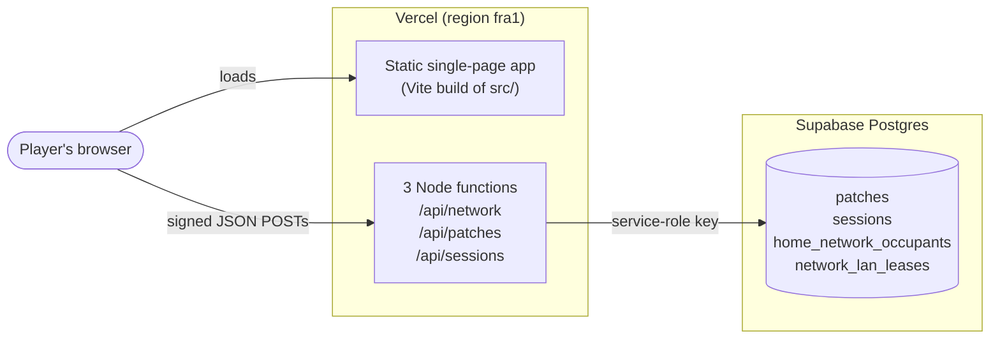
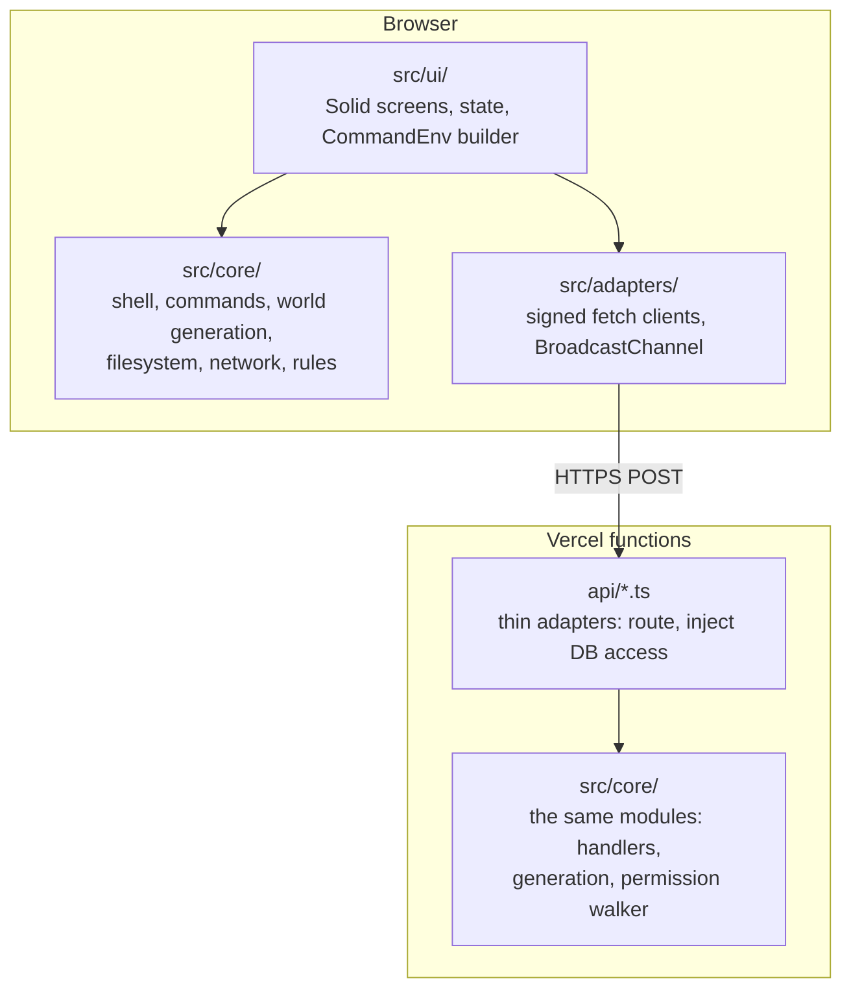
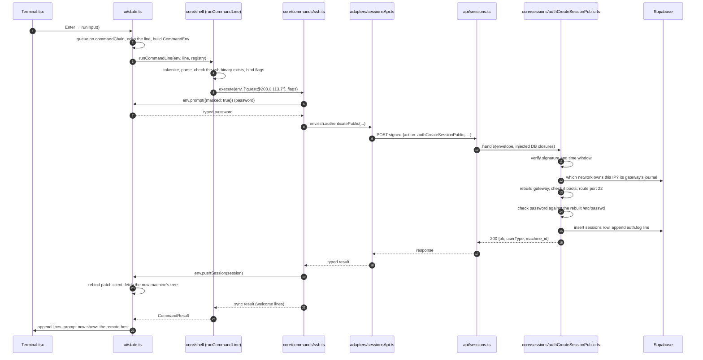

# 1. Architecture overview

This chapter is the map. It explains what the system is made of, the handful of ideas the whole
design rests on, which technologies it uses and why, and how one command travels through the system.
Every later chapter zooms into one part of this picture. Read this one first, completely.

## What the game is

jshack.me is a browser game played entirely in a simulated terminal. Each player owns an in-game
workstation. They crack a WiFi network's password, join it, scan the machines on it, find a way into
them (passwords, weak services, published vulnerabilities), and defend their own box from other
players doing the same. Players who join the same WiFi network share it: they see the same machines
and can reach each other's workstations.

Everything is simulated. A "machine" is a tree of in-memory objects, "the network" is a set of pure
functions, and "hacking" means calling commands that read and write that data. Nothing touches a real
system.

## The system at a glance

_The browser runs the game; three functions guard the shared state; one database holds only what
players changed. There are no user accounts: a player is a keypair in the browser._

Inside the browser and inside the functions, the same TypeScript runs:

_`src/core/` is imported by both sides. That is how the client's view and the server's decision
agree: they run the same code._

## The ideas everything rests on

### 1. The world is computed, not stored

Networks, machines, files, accounts, services and logs are generated on demand by pure functions from
short seed strings, mostly the network's key (for a hand-written landmark, its WiFi name; for a
network a town draws, its place, such as `r0/t3/n7`). Every player who joins a network gets
byte-identical machines, and the server regenerates exactly the same trees when it needs them.
Nothing about the base world is in the database. See [chapter 6](./06-world-generation.md).

### 2. Every change is a patch in one shared journal

When anyone changes anything on any machine (edits a file, starts a service, adds a firewall rule,
deletes `/boot/vmlinuz`), it becomes a whole-file row in the `patches` table, keyed by
(machine, path, writer). A machine's current state is its generated base with every row replayed in
server-timestamp order, last write per path winning. Deletes are tombstones. See
[chapter 9](./09-persistence-and-multiplayer.md).

### 3. Files are the source of truth for behaviour

There are almost no special data structures for game state. What is running is the pidfiles in
`/var/run`. Port forwards and filters are lines in `/etc/iptables/rules.v4`. Whether a command exists
on a box is whether its binary is in `/bin`, `/usr/bin` or `/usr/sbin`. Package versions (and so vulnerabilities) are
`/var/lib/dpkg/status`. Whether a box boots is whether its `/boot` files exist. Because every
behaviour is a file, every player action is a file write, and every reader sees it by replaying the
journal. See [chapter 7](./07-network-filesystem-scanning.md).

### 4. One core, two runtimes

`src/core/` is framework-free TypeScript used by both the browser and the Vercel functions: the
generators, the permission walker, `canBoot`, the reachability resolvers, the vulnerability
derivation, the server handlers. The client uses it to **render** instantly; the server uses the same
code to **authorize**. Because both run the same functions, they cannot disagree about what a box
contains or who may write to it.

### 5. The client renders, the server decides

Anything that affects another player, or that a cheater would want to forge, is decided on the
server: logins, privilege changes, exploits, remote writes, game time, log timestamps, and the
source address logged for a visitor from another network. The client sends intentions (an address and a port, a typed password), never
claims (a tier, a vulnerability, a time). A forged client can change what its own player **sees**,
never what they **get**. See [chapter 8](./08-sessions-and-vulnerabilities.md) and
[chapter 10](./10-server-and-database.md).

### 6. Identity is a keypair; every request is signed

A player is an Ed25519 keypair generated in the browser and kept in `localStorage`. Every request is
a signed envelope; the server verifies it and uses only the verified public key as the caller. There
is no login, no password and no account database.

### 7. Pull, never push

The server never pushes anything. After a write the client re-pulls the journal; before each command
on someone else's machine it re-pulls that machine. Other players' changes appear on the next pull.
There is no Supabase Realtime, by design.

### 8. Defences do not announce themselves

A game-design rule with architectural consequences: an absent host, a bricked box, a stopped service,
a filtered port and a wrong password all answer alike wherever the player should not be able to tell
them apart. Otherwise a scan would tell a player which doors are worth attacking. New refusals must
follow the same rule.

## Layers and dependency rules

| Layer            | Folder          | May import                                           | Must not import                         |
| ---------------- | --------------- | ---------------------------------------------------- | --------------------------------------- |
| UI               | `src/ui/`       | `core/`, `adapters/`, `solid-js`                     | —                                       |
| Adapters         | `src/adapters/` | `core/`, `zod`                                       | `ui/`                                   |
| Core             | `src/core/`     | `core/` only, `zod`, `@noble/*`                      | `ui/`, `adapters/`, `solid-js`, the DOM |
| Server endpoints | `api/`          | `src/core/`, `@supabase/supabase-js`, `@vercel/node` | helper modules in `api/` itself         |
| Scripts          | `scripts/`      | `src/core/`, `@supabase/supabase-js`                 | —                                       |

Inside `core/`, two more rules: `core/generation/` imports nothing from `core/commands/`, and
`core/packages/` imports nothing from `core/commands/`. Commands see the outside world **only**
through the `CommandEnv` object the UI builds for each line ([chapter 4](./04-client-runtime.md)).

These rules bind production code. A few test files cross them on purpose (some
`core/generation/*.test.ts` files use the real patch adapter or real commands to prove a generated
file survives the actual write path).

## Technology choices

| Technology                                            | Used for                                           | Why                                                                                                                    |
| ----------------------------------------------------- | -------------------------------------------------- | ---------------------------------------------------------------------------------------------------------------------- |
| **TypeScript** (strict, `exactOptionalPropertyTypes`) | Everything                                         | Strict types on a large, rule-heavy codebase; one language across client, server and scripts.                          |
| **Solid.js** (used minimally)                         | UI reactivity                                      | Signals without React's stale-closure bugs, which plagued the legacy app. Treated as a state library, not a framework. |
| **Vite**                                              | Dev server and build                               | Fast, standard, same as the legacy app.                                                                                |
| **Tailwind CSS v4**                                   | Styling                                            | CSS-first, no config file; colours come from CSS custom properties set by the theme.                                   |
| **Vercel Functions** (Node, ESM)                      | The three API endpoints                            | The front end and API deploy together from one repository.                                                             |
| **Supabase Postgres**                                 | The shared journal, sessions, occupancy, addresses | Managed Postgres. Used only through the service role; row-level security denies everything else.                       |
| **zod**                                               | Schemas at trust boundaries                        | Every signed payload and every file a player could have edited (databases, stores) is parsed, never cast.              |
| **@noble/ed25519, @noble/hashes**                     | Player keys, request signatures, SHA-256/512       | Small, audited, pure-JS cryptography that runs identically in the browser and Node.                                    |
| **Vitest + jsdom + @solidjs/testing-library**         | Unit and UI tests                                  | One runner for core and UI. Browser Mode is deliberately not used.                                                     |
| **Stryker**                                           | Mutation testing                                   | Measures whether tests would catch a change; run once per phase.                                                       |
| **agent-browser**                                     | Manual end-to-end runs                             | Drives a real browser for the few things only a browser can prove.                                                     |

There is deliberately no router, no global state library, no ORM, no auth provider, no Realtime and
no IndexedDB.

## The life of one command

A player on their own workstation, already connected to a WiFi network, types
`ssh guest@203.0.113.7` (a public IP) and enters a password.

_The browser prepares and renders; the server rebuilds the target, checks the password against the
target's own files, and records both the session and the trace._

## Security model, and its honest limits

| Layer                             | Protects against                                              | Where                                          |
| --------------------------------- | ------------------------------------------------------------- | ---------------------------------------------- |
| Signed envelope + 2-minute window | Forged requests, most replays                                 | `core/signedRequest/`                          |
| L1: session presence              | Acting on a machine you have no session on                    | `core/patches/authorizeMachineAccess.ts`       |
| L2: tier walker                   | Writing where your tier may not                               | `core/patches/remoteWritePermission.ts`        |
| Three-tier read filter            | Reading another player's files beyond your tier               | `core/patches/readFilter.ts`                   |
| Server-side derivation            | Forged tiers, vulnerabilities, time, cross-network source IPs | `core/sessions/`, `core/cve/`, `core/logging/` |
| Row-level security (deny all)     | Direct database access with the public key                    | `supabase/migrations/`                         |
| Obfuscated spoiler pools          | Grepping the bundle for answers                               | `core/secrets/`, `scripts/encode.ts`           |

Limits a maintainer must know:

- Replay protection is only the 120-second timestamp window; the nonce store is a deliberate no-op.
- Your **own** box has no server-side permission checks: anyone with your key can write any path on it.
- The spoiler pools are obfuscated, not secret: the key ships in the bundle.
- `listPatches` returns a machine's raw journal to anyone with any session on it, which may expose
  rows the tier filter would prune. This is unverified; see [known issues](./13-known-issues.md).
- The design deliberately stops at "enough to launch" (the conventions doc calls this "ship-first on
  multiplayer security").

## History: why there is a "v2"

The game was first built as a React app, single-player first, with multiplayer retrofitted later. That
produced repeated structural problems and many React stale-closure bugs. It was rewritten from
scratch in Solid.js as a multiplayer-first, server-authoritative design with a framework-free core.
The rewrite became the whole repository; the old app's source is at git tag `legacy-final` and its
design notes are in [`docs/legacy/`](../legacy/README.md). "v2" in commit scopes and docs refers to
this codebase.

The design intent written before the rewrite is in
[`legacy/rewrite-blueprint/`](../legacy/rewrite-blueprint/README.md). It is historical: where it
differs from the code (it mentions a `/v2` folder, local-only deployment, a Solid store), the code
wins.

## Where to go next

- To run it: [chapter 2](./02-local-development.md).
- To find your way around the folders: [chapter 3](./03-codebase-map.md).
- Then the chapter for the part you are changing.
