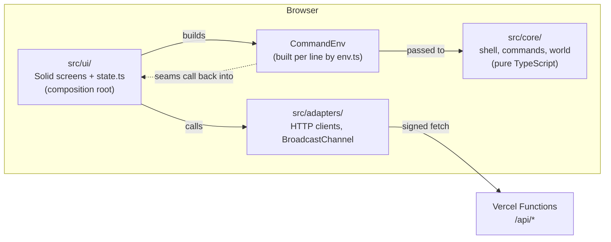
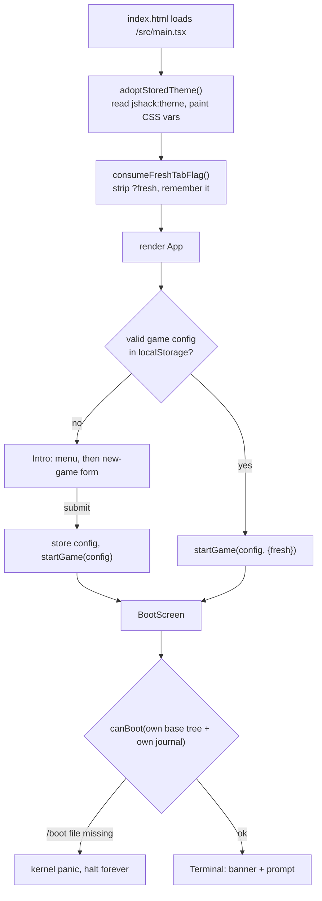

# 4. The client runtime: boot, state, terminal and screens

This chapter explains the part of the game that runs in the browser around the game logic: how the
page boots, where all mutable client state lives, how a typed line becomes rendered output, and how
full-screen apps such as `nano` and `lynx` take over from the terminal. Read it before you touch
anything in `src/ui/`, or before you add a capability that commands need from the outside world.

The game logic itself (commands, the shell, the world) lives in `src/core/` and is covered in
chapters 5 to 8. This chapter is about the layer that hosts it.

## The shape in one paragraph

`src/ui/` is the only framework-aware part of the client and the **composition root** of the app. It
holds all mutable game state as module-level Solid signals in one file, `src/ui/state.ts`. It wires
the pure `core/` to the HTTP clients in `src/adapters/` and to browser globals (`localStorage`,
`window`, `document`). For every command line it builds a fresh `CommandEnv` object
(`src/ui/env.ts`) and hands it to the shell. Commands never import the UI or the adapters. They see
the outside world only through that `CommandEnv`.

_The UI builds the `CommandEnv` and owns the adapters. `core/` never imports either; it reaches the
server only through seams on the `CommandEnv` that the UI wired._

## Key files

| Path                                                       | What it does                                                                                                                                                                                                               |
| ---------------------------------------------------------- | -------------------------------------------------------------------------------------------------------------------------------------------------------------------------------------------------------------------------- |
| `index.html`                                               | Static shell: meta tags, favicon, `
`, loads `/src/main.tsx`.                                                                                                                                                |
| `src/main.tsx`                                             | Entry point. Paints the saved theme, spends the `?fresh` flag, renders `<App>`.                                                                                                                                            |
| `src/index.css`                                            | Imports Tailwind; declares fallback `--theme-*` colours so the page is painted before JS runs.                                                                                                                             |
| `src/ui/state.ts`                                          | **The** client state module (~2,000 lines): every signal, `startGame`, `runInput`/`executeLine`, prompts, history, completion, session push/pop, tree acquisition, sub-shells, theme, and `resetGame` (behind `new-game`). |
| `src/ui/env.ts`                                            | `buildCommandEnv(args)`: a pure factory that turns UI state plus injected callbacks into the `CommandEnv` a command receives.                                                                                              |
| `src/ui/screens/App.tsx`                                   | The phase gate: `intro` → `booting` → `terminal`.                                                                                                                                                                          |
| `src/ui/screens/Intro.tsx`                                 | First-launch menu and new-game form (workstation name, username, root password).                                                                                                                                           |
| `src/ui/screens/BootScreen.tsx`                            | Timed fake kernel boot that doubles as the "is this machine bricked?" check.                                                                                                                                               |
| `src/ui/screens/Terminal.tsx`                              | Scrollback, prompt, input, busy bar, keyboard handling, and the overlay switch.                                                                                                                                            |
| `src/ui/screens/Nano.tsx`, `Lynx.tsx`, `Author.tsx`        | Full-screen overlay apps: text editor, text-mode web browser, author card.                                                                                                                                                 |
| `src/ui/renderPage.ts`                                     | Turns an in-game HTML page into text lines with numbered links and form fields, for `lynx`.                                                                                                                                |
| `src/ui/activeRoot.ts`                                     | Chooses which filesystem tree the shell is standing in and replays the journal over it.                                                                                                                                    |
| `src/ui/sessionRehydrate.ts`                               | Rebuilds the session stack from the server's session rows after a reload.                                                                                                                                                  |
| `src/ui/connectionPersistence.ts`                          | Remembers which WiFi network (ESSID) you were connected to across reloads.                                                                                                                                                 |
| `src/ui/themePersistence.ts`, `src/ui/theme/applyTheme.ts` | Store and paint the colour theme.                                                                                                                                                                                          |
| `src/ui/identity.ts`, `src/ui/seed.ts`                     | Page-lifetime memo of the player's keypair; the player's own base session and base filesystem.                                                                                                                             |
| `src/ui/freshTab.ts`                                       | Reads and strips the `?fresh` query flag used by the `xterm` command.                                                                                                                                                      |
| `src/ui/sleep.ts`                                          | `abortableSleep`: the real implementation of `env.sleep`, cancelled by Ctrl-C.                                                                                                                                             |
| `src/core/boot/`                                           | Pure boot logic: `canBoot` (brick check), boot-id marker, shared boot-failure text.                                                                                                                                        |
| `src/core/theme/themes.ts`                                 | The colour palettes as data (4 themes × 10 colour tokens).                                                                                                                                                                 |
| `src/core/types.ts`                                        | Branded primitive types used everywhere (`MachineId`, `AbsPath`, `PlayerKeyHex`, `EpochMs`, …).                                                                                                                            |
| `src/adapters/crossTabSync.ts`                             | BroadcastChannel wrapper that tells other tabs "your journal changed".                                                                                                                                                     |

## Why Solid, and how little of it

The UI uses Solid.js deliberately minimally (rewrite decision D2 in
[`legacy/rewrite-blueprint/decisions.md`](../legacy/rewrite-blueprint/decisions.md)). It is treated
as a reactivity library, not an app framework:

- **Used:** `createSignal`, `createEffect`, `createMemo` and `on` (in `Lynx` only), `onMount`/`onCleanup`, `Show`, `For`,
  `Switch`/`Match`, JSX.
- **Not used:** Router, Context, stores, `createResource`, `Suspense`, ecosystem packages.

State is module-level signals. Screens are mostly prop-driven renderers. The test the original
design set is: "if we swapped Solid for plain DOM tomorrow, how much would change?" The answer should
be "the screens", not "the architecture". The legacy React app suffered from stale-closure bugs; that
is why the rewrite chose signals and kept logic out of components.

## Boot: from page load to the first prompt

_A returning player skips the intro. Every boot runs the brick check; a failed check never reaches
the terminal._

Step by step:

1. **Theme first.** `main.tsx` calls `adoptStoredTheme()` synchronously, before `render`. It reads
   `jshack:theme` from `localStorage` and writes the palette as CSS custom properties on `<html>`.
   Doing this in a Solid effect would paint one frame of the default amber theme first.
2. **The `?fresh` flag.** `consumeFreshTabFlag` reads the query string and immediately strips it
   with `history.replaceState`. The `xterm` command opens a new tab with `?fresh`, which means "boot
   at home on your own box, do not restore remote sessions". Spending the flag at once means a later
   reload of that tab boots normally.
3. **Phase gate.** `App.tsx` reads the stored game config once. With a valid config it calls
   `startGame` straight away and goes to `booting`; otherwise it shows `Intro`. Validation rules for
   the form (hostname and username patterns, reserved names such as `root` and `guest`, password
   length) live in `src/core/gameConfig/gameConfig.ts`.
4. **`startGame(config, options)`** in `state.ts` is **the only place config-derived state is
   built**. In order, it:
   1. loads or creates the player's Ed25519 identity (`getOrCreateIdentity(localStorage)`, memoized
      for the page in `ui/identity.ts`). A brand-new player's keypair is generated here;
   2. creates the base session (`seedSession`): the player logged in as themselves on their own
      workstation, whose id is `<machineName>-<8 hex chars derived from the public key>`;
   3. seeds the network interfaces (`lo` up, `eth0` down, `wlan0` up but not associated) and the
      list of nearby WiFi networks, both derived deterministically from the public key, then
      restores the WiFi association if one was saved;
   4. builds the HTTP client dependencies (patches, sessions, network) and the patch API, wrapped by
      `wrapWithRefetch` (see [chapter 9](./09-persistence-and-multiplayer.md));
   5. resets UI state (cwd to `/home/<username>`, empty scrollback, empty journal, cleared history);
   6. opens the cross-tab `BroadcastChannel`;
   7. fires `refetchPatches()` to load the active machine's journal from `/api/patches`
      (fire-and-forget);
   8. unless `fresh`, fires `rehydrateSessions()` to rebuild the remote-session stack from the
      server's session rows.
5. **BootScreen** plays a scripted BIOS, GRUB and systemd sequence (about 3.6 seconds). In parallel
   it runs `resolveBootCheck()`: fetch the player's own journal, apply it over their own base
   filesystem, and call `canBoot`. If `/boot/vmlinuz` or `/boot/initrd.img` has been deleted (by
   another player, see [chapter 8](./08-sessions-and-vulnerabilities.md)), the screen plays a kernel
   panic and **halts forever**. A failed fetch counts as "no patches", so a network error never
   bricks a healthy box.
6. **Terminal** mounts, shows the ASCII banner with the version (`__APP_VERSION__`, injected by Vite
   from `package.json`), and focuses the prompt.

The player's own filesystem is **never built eagerly**. `seedFs()` regenerates it from the seed every
time `activeRoot()` needs it, with no cache. That is cheap enough (about 1–2 ms), and the build's
budget check guards it (see [chapter 12](./12-build-deploy-operate.md)).

## Where client state lives

### `localStorage` (the only client-side persistence)

There is no IndexedDB. Everything that must survive a reload is either in `localStorage` or on the
server.

| Key                        | Written by                                                                               | Holds                                                                                             |
| -------------------------- | ---------------------------------------------------------------------------------------- | ------------------------------------------------------------------------------------------------- |
| `jshack.identity`          | `core/identity/identity.ts`                                                              | The Ed25519 keypair as hex. Malformed → silently regenerated (which means a new world).           |
| `jshack.gameConfig`        | `core/gameConfig/gameConfig.ts`                                                          | `{machineName, username, rootPassword}`, re-validated on load. The root password is a game token. |
| `jshack:theme`             | `ui/themePersistence.ts`                                                                 | A theme id; anything unknown reads as `amber`.                                                    |
| `jshack:connected-essid`   | `ui/connectionPersistence.ts`                                                            | The WiFi network `wlan0` is associated with; removed on disconnect.                               |
| `jshack:lan-lease:<essid>` | `ui/connectionPersistence.ts` (via `lanLeaseCacheIn` in `core/network/lanLeaseCache.ts`) | The LAN IP the server leased you on that network. Kept after disconnect.                          |

Command history and scrollback are **not** persisted. The `new-game` command calls
`localStorage.clear()` and reloads, so the next boot has no identity, generates a new keypair, and
therefore gets a new world.

### Module-level state in `state.ts`

Two kinds:

- **Plain `let` bindings** set up by `startGame`: `identity`, `config`, the three client dependency
  objects, `patchApi`, `syncChannel`. `rebindPatchClient` later re-points `patchClientDeps` and
  `patchApi` at the active machine on every hop. They are read at call time, deliberately not
  reactive. Also `activeRun` (the current `AbortController`) and `commandChain` (see below).
- **Solid signals**, all `createSignal` holding immutable values:

| Signal                                                | Meaning                                                                                                                                 |
| ----------------------------------------------------- | --------------------------------------------------------------------------------------------------------------------------------------- |
| `sessionStack`                                        | The hop chain. Index 0 is the base login (never a server row); the top is the active session.                                           |
| `returnCwdStack`                                      | The cwd to restore when each pushed session is exited, in lockstep with the stack.                                                      |
| `scrollback`                                          | Rendered output lines (`text`, `error`, `dim`, `prompt`).                                                                               |
| `input`, `commandHistory`, `historyNav`               | The prompt's input value and ↑/↓ recall.                                                                                                |
| `cwd`                                                 | Shell working directory.                                                                                                                |
| `patches`                                             | The journal of the **active** machine; swapped when the active machine changes.                                                         |
| `servedRoot`                                          | A server-materialized tree for a machine owned by another player, tagged with its machine id.                                           |
| `connectivity`, `wifiNetworks`, `wifiScanIndex`       | Network interface state and the latest WiFi scan.                                                                                       |
| `overlayMode`                                         | Which full-screen app is up (`nano`, `lynx`, `author`) or `null`.                                                                       |
| `ftpSession`, `ftpCwd`, `ftpPatches`, `ftpServedRoot` | The parallel `ftp>` sub-shell: its own session, cwd, journal and tree for the target.                                                   |
| `mysqlConnection`, `redisConnection`                  | The held connection for the `mysql>` sub-shell (with its credential) and the `redis>` sub-shell (address and port only). No server row. |
| `runningCommand`, `childCommand`                      | Busy-bar label; a child (for example, `nmap` run from a script) wins over its parent.                                                   |
| `pendingPrompt`                                       | An in-flight `env.prompt()` (for example, a password prompt) with its resolve/reject.                                                   |
| `currentTheme`, `bannerVisible`                       | Palette in use; whether the ASCII banner shows (`clear` hides it).                                                                      |

**Importing `state.ts` must have no side effects.** It reads no storage and builds no identity at
import time, because a new player has no config yet; an earlier eager version crashed. A test in
`state.test.ts` ("does not read game config from storage at import time") pins this.

## From Enter to rendered output

1. `Terminal.tsx`'s key handler: Enter calls `submitPrompt()` if a prompt is pending, otherwise
   `runInput()`.
2. `runInput` takes the input, pushes it to history, clears the input, and **chains**
   `executeLine(line)` onto `commandChain`, a promise chain. Only one command ever runs at a time.
   This matters because a command's filesystem view is a snapshot taken when its env is built; two
   concurrent commands would read stale trees.
3. `executeLine`:
   1. reads the active session and patch API at execution time (so a queued line sees the previous
      line's `ssh` hop);
   2. echoes the line into scrollback as `user@host:cwd$ line` (or the sub-shell prompt);
   3. if the active machine is not the player's own box (or the session is an `nc` backdoor, even
      on your own box), re-pulls its tree first (`needsFreshTree`), so what you see reflects other
      players' edits. An ordinary session on your own box issues no request per command;
   4. stamps the machine's boot id onto the session the first time it is seen (this is how a reboot
      evicts visitors, see chapter 8);
   5. creates an `AbortController` for Ctrl-C and shows the busy bar;
   6. builds the `CommandEnv` with `buildCommandEnv({...})`, passing about 70 callbacks;
   7. **dispatches.** If a `mysql>`, `redis>` or `ftp>` sub-shell is open, the line goes to that
      sub-shell's interpreter and **never** falls through to the main command registry (a security
      boundary). Otherwise it goes to `runCommandLine` in `core/shell` (chapter 5);
   8. handles the result: `sync` lines are appended; `async` lines are appended as they stream in;
      `mode_change` opens an overlay. If the stream throws because Ctrl-C aborted it,
      `executeLine` appends `^C`. It is the only place that writes `^C`, so redirects and pipes are
      never polluted by it.
   9. clears the busy bar in `finally`.

### Keyboard

| Key    | Behaviour                                                                                                                       |
| ------ | ------------------------------------------------------------------------------------------------------------------------------- |
| Enter  | Submit the pending prompt, or run the line.                                                                                     |
| Ctrl-C | Cancel a pending prompt, or abort the running command. When nothing is running it is **not** intercepted, so native copy works. |
| Ctrl-L | Clear the screen (scrollback and banner). Works even at a password prompt.                                                      |
| ↑ / ↓  | History recall; the first ↑ saves your draft and ↓ past the newest restores it. Disabled at a password prompt.                  |
| Tab    | Completion (commands, paths, flags, keyword arguments). Disabled at a password prompt.                                          |

While a command runs, the input is unmounted and replaced by the busy bar, so a window-level
`keydown` listener catches Ctrl-C instead.

**How Ctrl-C reaches a command:** `abortRunning()` aborts the run's `AbortController`, so
`env.signal` fires and any `env.sleep()` rejects. A streamed command's generator then throws, and
`executeLine` prints `^C`. A command that awaits a network call rather than `env.sleep` must check
`env.signal.aborted` itself (`scp` is the example).

**How a password prompt works:** a command calls `env.prompt({message, masked})`. The UI sets
`pendingPrompt`, shows the message as the prompt, and switches the input to `type="password"` when
masked. On Enter, only the prompt label is echoed, never the typed value. Commands wrap
`env.prompt` in `try/catch` to turn a Ctrl-C cancel into their own "aborted" result.

### Tab completion

`tabComplete()` calls `complete(line, cursor, adapter)` in `core/shell/complete.ts`. The adapter
exposes registry command names, the active machine's filesystem at the active user's tier, and path
resolution against `cwd`. One match replaces the word; several matches are printed as a list.
Completion always uses the main registry, even inside a sub-shell.

## The `CommandEnv`: everything a command can touch

`CommandEnv` is declared in `src/core/commands/types.ts` and built by `buildCommandEnv` in
`src/ui/env.ts`. It is the **single seam** between pure game logic and the outside world.

| Group                        | Members                                                                                                                                                                                                                 |
| ---------------------------- | ----------------------------------------------------------------------------------------------------------------------------------------------------------------------------------------------------------------------- |
| Who and where                | `identity`, `session` (active), `hopChain` (sessions below it), `hostname`, `workstationName`, `now()` (local clock for ephemeral values only; **never game time**)                                                     |
| Filesystem                   | `fs`: a view over `activeRoot()` at the session's tier. It is a **snapshot** taken when the env was built; `fs.reload()` re-pulls.                                                                                      |
| Network view                 | `network`: current machine, interfaces, online state, WiFi list, rescan                                                                                                                                                 |
| Output                       | `output.text/error/dim`: append to scrollback mid-command                                                                                                                                                               |
| Server-backed APIs           | `patches` (file writes), `log` (auth/kern/access log appends), `remote` (public web fetch/sweep), `homeNetwork`, `ssh`, `nc`, `ftp`, `mysql`, `redis`, `snmp`, `scp`, `apt`, `su`, `reboot`, `hydra`, `exploit`, `scan` |
| UI-state writers             | `setCwd`, `setInterface`, `prompt`, `pushSession`, `popSession`, `resetGame`, `clearScreen`, `currentTheme`, `setTheme`, `openTerminal`, `setChildCommand`                                                              |
| Run control                  | `signal` (per-run `AbortSignal`), `sleep(ms)` (abort-aware)                                                                                                                                                             |
| Set by the shell, not the UI | `stdin` (pipelines), `argv0`, `scripted` (when run from a script)                                                                                                                                                       |

Apart from a few required members (`patches`, `log`, `prompt`, `onPushSession`, the connectivity
and signal arguments), the server seams are optional in `BuildCommandEnvArgs` so unit tests can
build a small env; `state.ts` always supplies all of them. When a seam is not wired,
`buildCommandEnv` follows a policy:

- **Loud** (throws `buildCommandEnv: <name> is not wired…`) for anything whose silent success would
  lie: logins, cracks, exploits, remote writes, database runs, `output.*`, `resetGame`, theme. The
  scan traces (`scan.record`, `recordDeep`, `recordZoneTransfer`) are loud too.
- **Quiet** (no-op or empty result) where silence is provably harmless: entering and leaving
  sub-shells, `ftp.recordTransfer`, `apt.recordDowngrade`, `scp.end`, `homeNetwork.leave`, and
  additive reads that default to `[]` or `null`. `homeNetwork.join` returns `null` because the
  client must never invent an IP address.

The test factory `mockCommandEnv()` in `src/test/factories/commandEnv.ts` builds a complete fake env
with sensible defaults; most command tests start from it.

## Sessions, hops and which tree you are standing in

A **hop** (`su`, `ssh`, `nc` backdoor, `exploit`) pushes a `Session` onto `sessionStack`. `exit`
pops it. The type is in `core/commands/types.ts`:
`{id, playerKey, machineId, username, userType, kind, createdAt, port?, bootId?}`.

- `pushSession` saves the cwd, pushes the session, persists it server-side if it is on your own
  workstation (remote sessions were already created by their own login round-trip), then calls
  `rebindPatchClient()`.
- `rebindPatchClient` re-points the patch client at the active machine, owner and tier. If the
  machine changed, it clears `patches` and re-pulls the journal, and fetches a served tree if the
  machine belongs to another player.
- `popSession` restores the cwd, ends the server row (fire-and-forget), and rebinds.

`activeRoot()` decides the tree the shell sees:

1. a served tree, if one is tagged for the active machine (another player's box, materialized by the
   server);
2. otherwise, if the active machine is another player's box, an **empty placeholder** until the
   served tree arrives. The UI never shows your own tree while you are standing on someone else's
   machine;
3. otherwise `resolveActiveRoot(...)`: regenerate the right base tree (your workstation, a machine on
   your LAN, a gateway, and so on) and replay the active journal over it.

### Reloads and rehydration

On a normal (non-fresh) boot, `rehydrateSessions()` lists your open session rows on the server and
`sessionRehydrate.ts` rebuilds the stack. Rows are sorted by `createdAt`; only `ssh`, `su` and
`exploit` rows are kept as hops. Every other open row (for example `ftp`, `scp`, `nc`) is closed as
`abandoned`. The cwd after a reload is the home directory of the top session, not the exact
directory you were in.

## Sub-shells and overlays

There are two ways a command can change what the terminal does.

**Sub-shells** (`ftp>`, `mysql>`, `redis>`) keep the terminal but replace the prompt and the
interpreter. `subShellPrompt()` is the single source for both the live prompt and the echoed line,
with precedence `mysql>` over `redis>` over `ftp>`. `ftp` gets its own session, cwd, journal and
served tree for the target machine, so you can transfer files between your box and the target.
`mysql` and `redis` only hold connection parameters.

**Overlays** replace the whole terminal with a full-screen app. A command returns
`{kind: 'mode_change', mode}` and `Terminal.tsx` swaps its content for the matching screen. There is
one `overlayMode` signal, so two overlays at once cannot be represented.

- **Nano** (`Nano.tsx`): a `<textarea>` editor. Ctrl-O saves through `saveEditor` in `state.ts`,
  which writes with the content you opened as `baseContent` (optimistic concurrency). If the server
  answers `modified_since_open`, nano asks `File was modified since you opened it, continue saving?
(y/n)`; `y` retries as an unconditional write.
- **Lynx** (`Lynx.tsx`): a text-mode browser over `renderPage()`. Arrow keys select links and form
  fields, Enter follows or submits (GET forms only), ← goes back, `q` quits. Following a link calls
  `followLink` in `state.ts`: it needs a WiFi association, resolves the host, fetches public
  addresses through the server and LAN addresses locally (which also appends an access-log line on
  the web server).
- **Author**: a static card with the author's links. It loads the only external asset in the game
  (a GitHub avatar).

`renderPage` parses HTML with `DOMParser`, which executes nothing, and walks the block structure to
produce lines. Links are numbered `[n]` in reading order, tables are padded into columns, password
inputs render as `[]` (never the value or its length), and scripts and styles are dropped.

## Multiple tabs

All tabs in one browser share `localStorage`, so they are the same player with the same world.

- After any successful write to your own machine, the writing tab refetches its journal and then
  broadcasts `{type: 'patches-changed', machineId}` on the `jshack-sync` `BroadcastChannel`. It is a
  hint only; no data goes over the channel. A receiving tab refetches only if the id is its own
  workstation.
- An ordinary second tab or a reload rehydrates the same server hop chain, so two tabs share one
  session stack. `exit` in one tab ends a row the other still thinks it holds. This is accepted.
- The `xterm` command opens a new tab with `?fresh`: it skips rehydration and starts at home on your
  own box.
- There are no `storage`, `visibilitychange` or unload listeners. A theme change in one tab shows in
  others only after a reload. Closing a tab ends nothing on the server; the next non-fresh boot
  sweeps abandoned rows.

## Theming

Palettes are pure data in `src/core/theme/themes.ts`: four themes, each with ten colour tokens
(`bg`, `text`, `textBright`, `textDim`, `error`, `caret`, `scrollThumb`, `scrollThumbHover`, `link`,
`avatarBorder`). `applyTheme(id)` writes them as `--theme-<kebab-name>` custom properties on
`<html>`. Components never hold colours; they use Tailwind arbitrary values such as
`text-[var(--theme-text-dim)]`. The `theme <name>` command calls `setTheme`, which sets the signal,
paints, and stores the choice in one function so the screen and storage cannot disagree.

## Rules you must not break

1. **Importing `ui/state.ts` has no side effects.** Anything derived from config or storage is built
   in `startGame`.
2. **Dependencies point one way:** `ui/` → `core/` and `ui/` → `adapters/`. `core/` never imports
   `ui/`, `adapters/`, or `solid-js`. Only `ui/state.ts` imports adapters. Code that needs the DOM
   (`renderPage`, `applyTheme`, timers) lives in `ui/`.
3. **One command at a time.** Never run two `executeLine` calls concurrently.
4. **An unwired seam is loud unless its silence is provably harmless.**
5. **The client never allocates addresses or decides authorization.** Without a server, doors
   degrade to a failure (`network_error`, unreachable, host down, `lost`), never to a success or an
   address the client made up. New seams should prefer "we could not ask" over any answer about the
   target.
6. **Another player's box is never rendered from your own tree.** Use the empty placeholder until the
   served tree arrives.
7. **Sub-shell dispatch is a security boundary.** A line typed at `ftp>`, `mysql>` or `redis>` never
   reaches the main registry.
8. **A typed secret never reaches scrollback.** Prompt echoes carry only the label.
9. **Only `executeLine` writes `^C`.** Commands throw on abort; they do not print it.
10. **A brick is permanent.** BootScreen never hands off after a failed `canBoot`. A transient fetch
    error must not brick a box.
11. **The `?fresh` flag is spent when read.** Otherwise every reload of an `xterm` tab would boot
    fresh and demote an elevated player while their `su` row stays open.

## How to…

### Add a full-screen overlay app

1. In `core/commands/types.ts`, add a `ModeChange` variant (`{kind: 'myapp', …}`), with a comment on
   why it is a screen and not a sub-shell.
2. Have the command return `{kind: 'mode_change', mode: {kind: 'myapp', …}}`. Mark it `withoutTty`
   (a backdoor shell without a terminal cannot show a screen) and `withoutScript` (nobody watches a
   screen from a script); see chapter 5.
3. In `ui/state.ts`, widen the `OverlayMode` `Extract` to include `'myapp'`.
4. Create `ui/screens/MyApp.tsx`: prop-driven, with an `onExit` prop, focusing itself on mount and
   owning the keyboard.
5. In `ui/screens/Terminal.tsx`, add a narrowing helper and a `<Match>` arm wired to `closeOverlay`.
6. New colours need a token in `ThemeColors`, a value in all four palettes, and a fallback in
   `index.css`.
7. Test it prop-driven in `MyApp.test.tsx`, plus one case in `Terminal.test.tsx`. Reset
   `setOverlayMode(null)` in `afterEach`, or a later test fails to find the input.

### Give commands a new capability (a new `CommandEnv` seam)

1. Add the member to `CommandEnv` in `core/commands/types.ts`.
2. Add an optional `onXxx` to `BuildCommandEnvArgs` in `ui/env.ts` and map it, choosing a loud stub
   or a harmless default, with a comment saying which and why.
3. Implement the backing function in `ui/state.ts` and pass it in the `buildCommandEnv({...})` call
   in `executeLine`.
4. Add a default to `mockCommandEnv` in `src/test/factories/commandEnv.ts`.
5. If it talks to the server: an adapter in `src/adapters/`, an `api/` action, and a wire-check
   script (chapters 9–11).
6. If it is a new `PatchApi` method, also route it through `wrapWithRefetch`, or other tabs and
   served trees will not hear about the write.

### Add a piece of UI state

Declare the signal at module level in `ui/state.ts` with a comment saying why it exists. If its
initial value depends on config or storage, set it inside `startGame`, never at import. Decide
whether `startGame` must reset it. Export only the getter (and a narrow setter if a screen needs
one). Tests that touch it must reset it; the pattern in `state.test.ts` is `vi.resetModules()` then
`await import('./state.js')`.

### Add a sub-shell like `mysql>`

Copy the ftp/mysql/redis shape: a connection signal, `enterX`/`leaveX` functions, an `X_PROMPT`
constant and a line in `subShellPrompt()`, a dispatch arm in `executeLine` **before** the registry
fallback, and `env.x.{connect, enter, leave, run}` seams in `env.ts`. Do not build a generic
sub-shell mechanism until a fourth one makes it worthwhile.

### Add a theme

Add the id to `ThemeId`, an entry in `THEMES` with all ten tokens, and its position in `THEME_IDS`
(the listing order). Nothing in `ui/` changes.

### Persist a new client setting

Write a small module that takes an injected `Pick<Storage, …>` (copy `themePersistence.ts`), read
defensively (a bad value becomes the default), and call it from `startGame` or `main.tsx`. `new-game`
clears it automatically.

## Pitfalls

- **`startGame` runs inside `App`'s component body** for returning players, before BootScreen
  mounts. `resolveBootCheck` relies on this.
- **Identity is memoized per page.** If only `jshack.identity` is wiped but the config survives, the
  next boot silently gets a new world with the old username and hostname.
- **A bricked player has no in-game way out.** Only clearing site data (and so getting a new
  identity) escapes the panic screen. This is intentional.
- **`env.fs` is a snapshot.** A command that writes and then re-reads `env.fs` sees the old tree. Use
  `env.fs.reload()`.
- **Journal hydration is fire-and-forget.** An `apt`-installed binary is "command not found" for the
  first moment after boot. In tests, await one `setTimeout(0)` before the first command.
- **Scrollback append is copy-on-write** (`[...previous, line]`). A command that prints thousands of
  lines is quadratic. It has not mattered yet.
- **`startGame` does not reset `overlayMode`, sub-shell connections, `servedRoot` or
  `wifiScanIndex`.**
- **Coming back online needs both** the stored ESSID and a remembered lease.
- **`consumeFreshTabFlag` strips the whole query string,** not just `fresh`.
- **`followLink` builds its own mini-environment** instead of using `buildCommandEnv`. Keep it in
  sync with the `lynx` command's fetch path.
- **Tailwind is off under Vitest,** and jsdom renders no CSS, so class-based visual assertions prove
  nothing in unit tests.
- **Every `npm run dev/build/test*` runs `npm run encode` first** to generate the git-ignored
  `src/core/secrets/__encoded.ts`. Running Vite or Vitest directly on a fresh clone fails to import
  it.

## Where it is tested

| Test file                                                                                                | What it covers                                                                                                                                                                                                       |
| -------------------------------------------------------------------------------------------------------- | -------------------------------------------------------------------------------------------------------------------------------------------------------------------------------------------------------------------- |
| `src/ui/state.test.ts`                                                                                   | The big integration suite. Stubs `localStorage` and `fetch` (serving `/api/*` JSON), imports `state.js` fresh, calls `startGame`, drives `setInput` + `runInput`, and asserts on `scrollback()` and `overlayMode()`. |
| `src/ui/screens/Terminal.test.tsx`                                                                       | Renders the terminal, types with `fireEvent`, and waits for the prompt with an `awaitPrompt()` helper: echo, busy bar, completion, Ctrl-L, themes, focus, overlays, sub-shell prompts.                               |
| `App.test.tsx`, `BootScreen.test.tsx`, `Intro.test.tsx`                                                  | Phase gate with fake storage and fake timers; boot hand-off and panics with an injected `resolveBoot`; form validation.                                                                                              |
| `Nano.test.tsx`, `Lynx.test.tsx`                                                                         | Prop-driven: an `onSave` or `onFollow` spy stands in for the state module.                                                                                                                                           |
| `renderPage.test.ts`, `env.test.ts`, `activeRoot.test.ts`, `sessionRehydrate.test.ts`, persistence tests | Pure units.                                                                                                                                                                                                          |

Patterns worth copying: inject storage, location and history rather than touching globals; keep
screens prop-driven so they test without the server; use `SEED_CONFIG` from `ui/seed.ts` as the
default game config.

## Deeper reading

- [Chapter 5](./05-shell-and-commands.md) for what happens inside `runCommandLine`.
- [Chapter 9](./09-persistence-and-multiplayer.md) for the journal, `wrapWithRefetch`, and served
  trees.
- [`cross-player-architecture.md`](../cross-player-architecture.md) §6 "Client integration".
