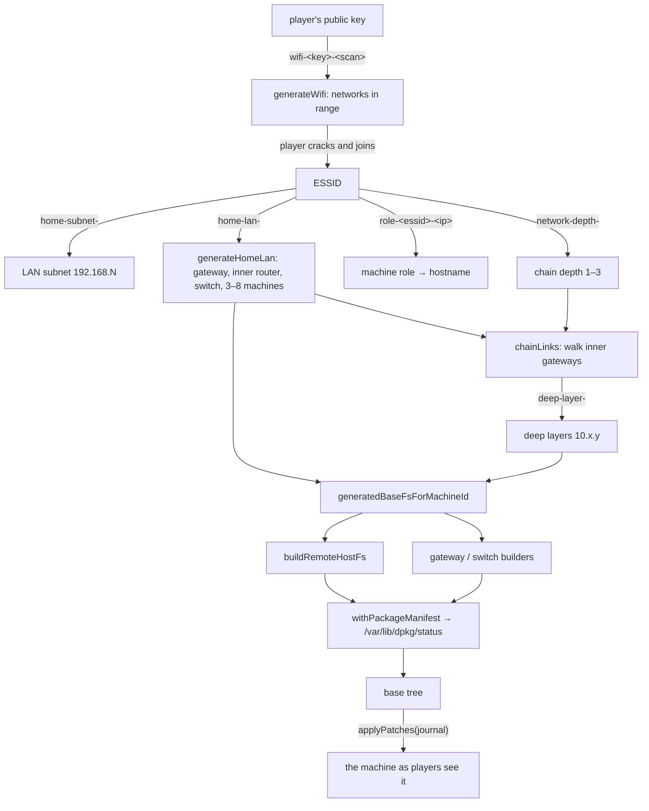

# 6. Procedural world generation

This chapter explains how the game builds its whole world, every network and every machine with its
files, accounts, services and logs, from a few short strings, on demand, with no stored copy. It
covers the random number generator, the "one stream per concern" rule that keeps the world stable as
content grows, what a generated machine contains, and the budgets that keep generation fast. Read it
before touching `src/core/generation/`, `src/core/services/`, `src/core/identity/` or
`src/core/secrets/`.

The standing content rules (believability, true references, frozen history, no version strings) are
in [`world-content-architecture.md`](../world-content-architecture.md). This chapter is the
engineering view; read that one before adding content.

## The shape in one paragraph

**The shared world is keyed by the WiFi network name (the ESSID), not by the player.** Given an ESSID,
pure functions produce the network's LAN, its gateways, a chain of hidden deeper networks, and the
complete filesystem of every machine on them. Every player who joins the same network sees
byte-identical machines, which is what makes shared networks and cross-player play possible. The
player's own key seeds only player-private things (their workstation, their WiFi scans, their
network card addresses). Nothing is cached: every lookup regenerates the tree it needs, on the client
and on the server alike, and player changes are a journal replayed on top (chapter 7).

_Everything left of the journal is a pure function of strings. Only the journal is stored._

## Key files

| Path                                                                                                                                                    | What it does                                                                                               |
| ------------------------------------------------------------------------------------------------------------------------------------------------------- | ---------------------------------------------------------------------------------------------------------- |
| `generation/prng.ts`                                                                                                                                    | The seeded pseudo-random generator: `createPrng(seed)` with `next`, `nextInt`, `pick`, `pickN`, `shuffle`. |
| `identity/identity.ts`                                                                                                                                  | Ed25519 keypair creation, storage and signing (`@noble/ed25519`).                                          |
| `identity/workstation.ts`, `identity/router.ts`, `generation/remoteHostId.ts`                                                                           | Machine id derivations (chapter 7 has the table).                                                          |
| `gameConfig/gameConfig.ts`                                                                                                                              | The new-game choices (machine name, username, root password) and their validation.                         |
| `generation/pools/essidCatalog.ts`                                                                                                                      | The catalog of named WiFi networks (57 as of v0.278.0), their categories, places and web sites.            |
| `generation/generateWifi.ts`                                                                                                                            | Which networks a WiFi scan shows, and each network's WiFi password.                                        |
| `generation/generateHomeLan.ts`, `generateDeepLayer.ts`, `lanTopology.ts`                                                                               | Network topology (filesystem-free).                                                                        |
| `generation/machineRole.ts`, `pools/hostnames.ts`, `rolePlacement.ts`                                                                                   | Machine roles, hostnames, and per-role service rates.                                                      |
| `generation/lanHostIdentity.ts`                                                                                                                         | Topology → trees: `baseFsForLanHost`, `generatedBaseFsForMachineId`.                                       |
| `generation/remoteHostFs.ts`                                                                                                                            | **The** generated-machine builder, `buildRemoteHostFs(essid, host)`.                                       |
| `generation/deepHostFs.ts`                                                                                                                              | A deep machine: a normal machine plus a forced `sshd` on port 22.                                          |
| `generation/routerFs.ts`                                                                                                                                | Gateway builders: access point, inner router, switch, deep router, deep switch.                            |
| `generation/workstationFs.ts`                                                                                                                           | A player's own workstation (a fresh install).                                                              |
| `generation/baseFs.ts`, `binaries.ts`, `libraries.ts`                                                                                                   | Tree helpers, permission constants, `/etc/passwd`, `/boot`, stub binaries and libraries.                   |
| `generation/passwordPools.ts`, `md5.ts`                                                                                                                 | Password pools, crack chances, and a deliberately weak MD5.                                                |
| `generation/persona.ts` and the content builders (`webSite.ts`, `generateDatabase.ts`, `networkMail.ts`, `share.ts`, `logHistory.ts`, `device/*.ts`, …) | Persona-coherent content.                                                                                  |
| `generation/pools/*.ts`                                                                                                                                 | Authored static text pools (hostnames, usernames, people, config templates, pages, mail, …).               |
| `services/serviceCatalog.ts`, `services/pidfile.ts`                                                                                                     | The seven network services and the one reader of "what is running".                                        |
| `packages/packageManifest.ts`                                                                                                                           | Stamps `/var/lib/dpkg/status` on every generated box.                                                      |
| `secrets/secrets.ts`, `secrets/contentCodec.ts`, `scripts/encode.ts`                                                                                    | Spoiler pools and their build-time obfuscation.                                                            |
| `cve/worldClock.ts`                                                                                                                                     | `WORLD_EPOCH`, the date all generated history ends.                                                        |
| `scripts/checkBudgets.ts`                                                                                                                               | The bundle-size and per-box build-time budget.                                                             |

## The random number generator

`createPrng(seedString)` in `generation/prng.ts`:

1. Hash the seed string to 32 bits with **FNV-1a** over UTF-16 code units (start `0x811c9dc5`, per
   character `hash ^= code; hash = Math.imul(hash, 0x01000193)`).
2. Each `next()` advances a **Mulberry32** state and returns a float in `[0, 1)`.
3. `nextInt(min, max)` is inclusive and uses one draw.
4. `pick(items)` uses **exactly one draw whatever the pool size**, so growing a pool changes which
   value is chosen but not the position of later draws.
5. `pickN(items, n)` is a partial Fisher–Yates shuffle on a copy (`min(n, length)` draws, no
   repeats). `shuffle` is `pickN(items, length)`.

The state update uses only 32-bit integer maths (`Math.imul`, `>>>`), and outputs are derived by
exact division and flooring, so it gives identical results on every JavaScript engine: browser, Node
on Vercel, tests. It is not cryptographic, and does not need to be.

### One stream per concern

Every concern creates its **own** generator from a namespaced seed string, for example
`web-site-<essid>-<ip>` or `svc-ssh-<essid>-<ip>`, instead of continuing a shared one. If two
concerns shared a stream, adding one draw to the first would shift every value in the second. For
example, one extra draw in the LAN stream would move machine addresses (which the server's lease
allocator avoids), and one extra draw in the per-box stream would re-roll every password in the
world. Separate streams make each concern independently editable: new content moves nothing that
already exists.

**The rule:** never add a draw to an existing stream. Create a new stream with a new namespace. The
few accepted exceptions are listed in the world-content doc (rule 11).

Examples of the namespaces in use:

| Keyed by    | Seeds                                                                                                                                                                    |
| ----------- | ------------------------------------------------------------------------------------------------------------------------------------------------------------------------ |
| Player key  | `workstation-<key>` (guest password), `network-<key>` (network card addresses), `wifi-<key>-<scanIndex>`, `home-<key>-<essid>` (preferred LAN octet), `db-app-own-<key>` |
| ESSID       | `wifi-pw-`, `home-subnet-`, `home-lan-`, `network-depth-`, `publisher-ip-`, `network-persona-`, `mail-network-`, gateway admin and SNMP secrets                          |
| One machine | `host-fs-<essid>-<ip>` (accounts), `svc-<service>-<essid>-<ip>`, `backdoor-`, `etc-config-`, `web-site-`, `mysql-db-`, `log-history-`, …                                 |
| Machine id  | `mac-<id>`, `gw-history-<id>`, …                                                                                                                                         |

## From ESSID to machines

### The home LAN

`generateHomeLan(essid)`:

1. Subnet `192.168.<0–255>` from the `home-subnet-` stream.
2. `.1` is the access-point gateway (a router) with a seeded hostname.
3. From the `home-lan-` stream: 3–8 machines, and distinct host octets for them plus one inner
   gateway (a router).
4. Each machine's **role** comes from its own stream `role-<essid>-<ip>`: workstation, IoT device,
   web server, file server, database, mail server or DNS server, weighted. If the network publishes a
   web site and no machine drew "web server", the lowest-octet machine is overridden to be one.
5. Hostname = `<prefix for the role>-<octet>`.
6. One switch, drawn **last** so adding it moved no earlier draw.
7. Hosts sorted by octet. Players are not included; callers overlay them.

The role is **never stored**. It is read back from the hostname prefix (`roleOfHostname`), because
some builders cannot see the stream that chose it. That is why no prefix may appear under two roles.

### The deep chain

`seedNetworkDepth(essid)` is 1–3. `chainLinks(essid)` walks each inner gateway (the router and the
switch) and, per layer, `generateDeepLayer` draws a `10.x.y` subnet, one terminal machine and, while
depth remains and the fronting device is a router, a child gateway (a switch one time in three). A
switch never hangs a child, so the chain ends there. A network has 2–4 deep machines and 0–2 deep
gateways.

### The whole world, measured

Measured on 2026-09-27 at v0.278.0 over the 57 catalog networks: 470 home-LAN hosts, 55 deep
gateways and 169 deep machines, **694 generated boxes** in total.

## What a generated machine contains

`buildRemoteHostFs(essid, host)` is a pipeline. In order:

1. **Accounts** from the `host-fs-` stream: `root` (uid 0), one role-flavoured user (uid 1000) and
   `guest` (uid 1001). Each password is drawn from a crackable or an uncrackable pool with a fixed
   chance (guest always crackable, user often, root rarely). `/etc/passwd` stores the MD5 hash
   **inline**; there is no `/etc/shadow`.
2. **Services**: for each of the seven catalog services, on its own stream, a placement roll against
   the role's rate, and sometimes an alternative port.
3. **A planted listener** on a small fraction of machines.
4. **Pidfiles** for each running service (`/var/run/<daemon>.pid` holding `<daemon>:port=<n>`).
5. **Role content**: DNS zone files, IoT device configuration and pages, role config files, a
   database (`/var/lib/mysql/data.json`), a key-value store, web sites under `/var/www/html`,
   `/etc` extras, mail, file shares.
6. **Logs**: empty live logs for things that exist, plus rotated `.1` history files dated before
   `WORLD_EPOCH`.
7. **Homes**: `.ssh` files naming real neighbours, desk or phone content, root's history that
   mentions the box's real configs.
8. **The package manifest** (`withPackageManifest`): `/var/lib/dpkg/status`, derived from the daemons
   the box carries, plus system libraries, with starting versions from `packages/packageVersions.ts`.

Permissions follow Debian: a guest sees the surface, a user sees a person, root sees history.

**Gateways** (`routerFs.ts`) are root-only boxes with `/boot`, `sshd`, optionally `snmpd`, firewall
configuration (`rules.v4` for routers, `acl.conf` for switches), network state (routers keep DHCP
leases naming the real machines on their segment; switches keep a MAC table instead), history,
backups and a local admin UI, and a firmware package. The access-point gateway always runs SNMP; its
`sshd` is a seeded roll against the router rate, which is currently 1, so it always runs today too.
Other gateways roll SNMP (routers 0.6, switches 0.9).

**A player's workstation** (`workstationFs.ts`) is a fresh install: root with the MD5 of the player's
chosen password, the player's own account with an empty hash, a crackable guest account, WiFi tools
pre-installed, empty logs. `buildWorkstationBaseFsFromIdentity` builds the identical tree on the
server from the stored hash (the server never sees the plaintext).

### Services

`services/serviceCatalog.ts` has one row per network service:

| Key     | Shown as | Port(s)             | Package        |
| ------- | -------- | ------------------- | -------------- |
| `ssh`   | ssh      | 22 (alt 2222, 8022) | openssh-server |
| `http`  | http     | 80 (alt 8080, 8000) | nginx          |
| `ftp`   | ftp      | 21 (alt 2121)       | vsftpd         |
| `mysql` | mysql    | 3306                | mysql          |
| `redis` | redis    | 6379                | redis          |
| `snmp`  | snmp     | 161/udp             | snmp           |
| `dns`   | domain   | 53                  | bind9          |

Each row also names its pidfile, run-as user, a **version-free** banner, placement rate, where
credential sweeps are logged (`sweepLog`), how an exploit is logged (`formatExploit`, required), and
where its accounts live (`accountsOn`). `services/pidfile.ts` is the **single** answer to "what is
running": every producer writes pidfiles through its formatter and every reader goes through
`readRunningProcesses` / `readOpenPorts`.

## Secrets: obfuscation, not secrecy

Some pools would hand a player the answer key if they searched the JavaScript bundle (the
uncrackable passwords, the WiFi passwords). They live as plaintext in `src/core/secrets/secrets.ts`,
which application code never imports. Before every `dev`, `build`, `typecheck` and test run,
`npm run encode` runs `scripts/encode.ts`, which writes the **git-ignored**
`src/core/secrets/__encoded.ts`: each value XOR-ed with a fixed key and Base64-encoded, decoded at
module load. Consumers import from `__encoded.js`.

This keeps the answers out of a `grep` of `dist/`. It is not secrecy: the key ships in the bundle and
the plaintext is in git. Changing the key only needs a re-encode; changing a pool re-rolls every
password drawn from it.

## Budgets: why generation must stay fast

Because nothing is cached, every command on the client and every request on the server pays the
generation cost. `scripts/checkBudgets.ts` runs after every `npm run build` and fails the build when:

- **the gzipped main JavaScript chunk exceeds 284,975 bytes** (the pre-content 134,975 bytes plus a
  fixed 150 KB allowance for content pools). Checked on Vercel too. The fix is to trim pools; the
  allowance does not grow.
- **building every box on every catalog network averages over 2 ms per box**, after a warm-up pass.
  Skipped on Vercel (`VERCEL=1`), whose builders are several times slower. The measurement is noisy
  near the line; measure three times. Before adding a cache, look for a lookup made twice inside one
  build (that fixed it once before).

It is a script, not a test, because Stryker runs the whole test suite under instrumentation and a
wall-clock assertion would break mutation runs.

Other size limits: a file a player can carry home must fit one signed write (payload up to 8,192
characters of JSON); the access-point gateway's root-visible tree must stay under 32,768 characters
because it is sent to every occupant.

> **Headroom note (2026-09-27):** one research run measured 1.61–1.83 ms per box against the 2 ms
> ceiling, while the docs record 0.86–1.67 ms. The machine may have been loaded. Measure with a clean
> `npm run build` before the next content change.

## `WORLD_EPOCH`

`WORLD_EPOCH` (`cve/worldClock.ts`, currently 2026-07-12 UTC) is the date all generated history ends.
Rotated `.1` logs are dated the day before it. It also anchors the vulnerability clock (chapter 8). A
tripwire test fails once it is 180 days stale (**from 2027-01-08**). Re-stamping it re-dates every
generated file in the world and every vulnerability; it is free before launch and irreversible after.

## Rules you must not break

1. **Determinism.** Every generator is a pure function of its inputs. The client and the server
   rebuild the same box independently and replay one journal over it; any divergence routes writes to
   a different machine than the one displayed.
2. **ESSID-keyed, never viewer-keyed**, for everything shared.
3. **One stream per concern; never add a draw to an existing stream.**
4. **Role is derived from the hostname**, never stored.
5. **Namespaced machine ids**; `ed25519:` is reserved for player workstations.
6. **`core/generation` imports nothing from `core/commands`.** `lanTopology.ts` and
   `generateDeepLayer.ts` import no filesystem builder (to avoid an import cycle).
7. **Crackability is decided at generation**: a password is crackable exactly when it came from the
   pool the shipped wordlist covers.
8. **MD5 is deliberately weak.** Hashes are meant to be crackable, including with real external
   tools. Do not change it.
9. **Catalog order is load-bearing**: scans pick networks by position.
10. **Deploy client and server together.** Both regenerate; a client and server built from different
    generator versions disagree about every box.

## How to…

### Add generated content to existing boxes

1. Decide the surface, the tier that may read it, and which boxes get it (by role, prefix or gateway
   vendor; never a player workstation).
2. Author the text as a pool in `generation/pools/<name>.ts`: static data, `{slot}` placeholders,
   version-free, aware of the network's category where it matters.
3. Write a builder in `generation/<name>.ts` that creates a **new** stream
   `createPrng('<concern>-' + essid + '-' + host.ip)`.
4. Make every reference true: take neighbours from `generateHomeLan(essid)` filtered to machines,
   accounts from `npcUsername`, ports from `hostServices`, and date everything before
   `WORLD_EPOCH`.
5. If two files must agree, return both from one function.
6. Wire it into `buildRemoteHostFs` or `buildGatewayBaseFs` without interleaving with other streams.
7. Add or extend a whole-world property test (a `*.test.ts` using the helpers in
   `src/test/worldContent.ts`, such as `lanBoxes`, `deepBoxes`, `ALL_ESSIDS`): no dead reference, no
   version string, no unfilled slot, no date after the epoch, no password-pool word, every pool
   entry reachable. Build fixtures inside each test.
8. Diff the whole world against `main` (build every box on both and compare by
   `<essid>/<ip>/<path>`) to prove only your surface moved. There is no committed script for this
   yet; the procedure is in the world-content doc.
9. Run `npm run build` locally for the budgets, and bump the version.

### Add a network service

1. Add a row to `SERVICE_CATALOG` (label, package, pidfile, ports, run-as user, version-free banner,
   placement, `sweepLog`, `formatExploit`, `accountsOn`).
2. Add per-role rates in `rolePlacement.ts`.
3. Add the package in `packages/aptPackages.ts` with its daemon, and a starting version in
   `packages/packageVersions.ts`.
4. Add the daemon to `DAEMONS` in `commands/daemon.ts` and a unit in `commands/systemctl.ts` in the
   same change (`systemctl.test.ts` checks they agree).
5. Add its log in `buildRemoteHostFs` (and rotation in `logHistory.ts` if it has history).
6. The new row gets its own stream, so existing boxes' other services do not move; boxes that newly
   run it will show new content.

### Add a network to the catalog

Append to `ESSID_CATALOG` with a category, a place, and optionally a web site. Fictional or parody
names only. A publisher gets a derived `193.x` public IP and a guaranteed web server. Changing the
list length changes which networks every WiFi scan offers, and moves the `generateWifi` golden test.

### Add a spoiler pool

Add it to `secrets/secrets.ts` as a JSON string, run `npm run encode`, and read it from `__encoded.js`.

## Pitfalls

- **The player's key is not the world seed**, despite a few stale comments (`prng.ts`,
  `gameConfig.ts`). It seeds only the player-private items listed above.
- **Public IPs of ordinary networks are random and stored**, not derived. Read `network_public_ips`.
- **`pickUsername` deliberately uses the caller's `host-fs-` stream.** Giving it its own stream would
  remove a draw and re-roll every generated password.
- **Renaming or adding a hostname prefix re-rolls machine ids** (the id embeds the hostname), which
  orphans existing journals and moves test pins.
- **`hostServices` covers machines only**, not gateways, and not the forced `sshd` on deep machines.
  When in doubt, read the tree with `readOpenPorts`.
- **The access-point gateway is not returned by `generatedBaseFsForMachineId`** on purpose; build it
  with `buildApGatewayBaseFs(essid)`.
- **`__encoded.ts` must exist.** Running `npx vitest`, `npx stryker run` or `npm run vercel:dev`
  directly on a fresh clone fails until `npm run encode` has run.
- **Existing leases outrank the machine-octet exclusion.** Changing `generateHomeLan` after launch
  could place a new machine on an address a player already holds.
- **Two template syntaxes**: content pools use `{slot}`; config and page templates use `{{hostname}}`.

## Where it is tested

About 40 test files in `src/core/generation/` (including `device/`). Golden tests pin algorithms end
to end (`generateHomeLan.test.ts`, `generateDeepLayer.test.ts`, `generateWifi.test.ts`, `ip.test.ts`,
`routerFs.test.ts`, `workstationFs.test.ts`, `identity/workstation.test.ts`). Whole-world property
tests sweep every catalog network plus a few uncatalogued ones. `services/generatedBoxDoors.test.ts`
runs real `systemctl` and `apt` commands against a generated box and replays the result. There is no
direct `prng.test.ts`; the algorithm is pinned through the golden tests.

## Deeper reading

- [`world-content-architecture.md`](../world-content-architecture.md): the content rules and budgets.
- [Chapter 7](./07-network-filesystem-scanning.md): how generated trees are materialized and reached.
