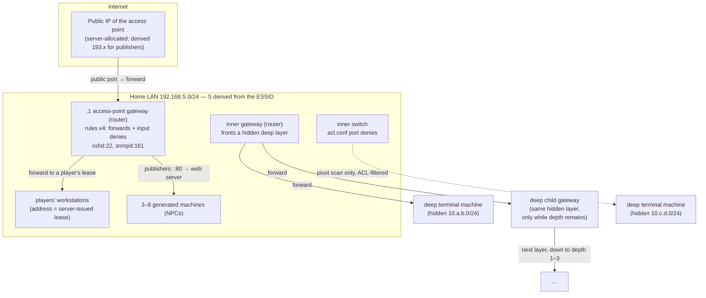

# 7. The simulated network, the virtual filesystem, and scanning

This chapter explains how the game models machines, files, networks, addresses and open ports, and
how it answers the two questions almost every command asks: "which box is at this address and
port?" and "what does that box look like right now?". Read it before touching `src/core/network/`,
`src/core/filesystem/`, `src/core/scan/` or `src/core/snmp/`.

Everything here is simulated. There are no sockets and no real hosts: a "machine" is a tree of
in-memory objects, and "reaching" it is a function call.

## The one idea to hold on to

**There is no stored network graph.** The world is recomputed from seeds on demand:

- **Topology** (which hosts exist on a WiFi network, their addresses, hostnames and machine ids) is a
  pure function of the network's name, its **ESSID**, run through a seeded pseudo-random generator
  (chapter 6).
- **A machine's current state** is its generated **base filesystem** with its **patch journal**
  replayed over it. The journal is the list of every change any player has made to that machine,
  stored in the `patches` table on the server (chapter 9).
- **Network behaviour** is read from **files** on that rebuilt tree: pidfiles in `/var/run` say what
  is listening, `/etc/iptables/rules.v4` holds port forwards and input filters, `/etc/switch/acl.conf`
  holds a switch's port denies, and `/boot` decides whether the box boots at all.

The only network state the server stores is: who is connected to which WiFi (occupancy), each
player's permanent LAN address on each network (leases), each access point's public IP, and the
patch journal.

This design means a player's change to a machine is just a file write. Forwarding a port is editing
`rules.v4` with `nano`; stopping a service deletes its pidfile; bricking a router deletes a file in
`/boot`. Every reader of the world sees the change because every reader rebuilds from the same
journal.

## Key files

| Path                                                                  | What it does                                                                                  |
| --------------------------------------------------------------------- | --------------------------------------------------------------------------------------------- |
| `filesystem/types.ts`                                                 | `FileNode = FileEntry \| Directory`, `FilePermissions`. No symlinks.                          |
| `filesystem/path.ts`                                                  | `resolveAbsPath`, `normalize`, `dirname`, `basename`, `ancestorPaths`.                        |
| `filesystem/applyPatches.ts`                                          | The `Patch` type and the fold that replays a journal over a base tree.                        |
| `filesystem/walker.ts`                                                | `canRead` / `canWrite`: the permission decision, **shared by client and server**.             |
| `filesystem/fsView.ts`                                                | `createFsView`: the read-only `read/list/stat/canWrite/reload` view commands get as `env.fs`. |
| `filesystem/walkTree.ts`                                              | Permission-respecting depth-first walk (used by `find` and `grep`).                           |
| `filesystem/writeTarget.ts`                                           | The one rule for where `>` and a script's `fs.writeFile` write.                               |
| `filesystem/treeCodec.ts`                                             | Converts trees to and from JSON (Maps do not survive `JSON.stringify`).                       |
| `network/interfaces.ts`                                               | Network interfaces (`lo`, `eth0`, `wlan0`), `connectedWlan0`, `isOnline`, `ownBoxSource`.     |
| `network/wifi.ts`                                                     | `WifiNetwork` and `bssidFromEssid`.                                                           |
| `network/lanAddress.ts`, `homeNetwork.ts`                             | The LAN subnet for an ESSID; a player's preferred host octet.                                 |
| `network/allocateLanLease.ts`                                         | Pure allocator for LAN leases (the server injects the database).                              |
| `network/registerNetwork.ts`, `unregisterOccupant.ts`                 | Join and leave a WiFi network (server handlers).                                              |
| `network/iptablesRules.ts`, `switchAcl.ts`                            | Parse and edit `rules.v4` and `acl.conf`.                                                     |
| `network/portsOpenToNetwork.ts`                                       | What a box answers to the **network**: running services minus its input denies.               |
| `network/machineServing.ts`                                           | Does a gateway port reach the gateway itself, a NAT forward, or nothing?                      |
| `network/resolvePublicTarget.ts`                                      | Public IP + port → the box it reaches.                                                        |
| `network/resolveInnerGatewayTarget.ts`, `deepLayerHop.ts`             | Inner-gateway IP + port → a box down the forward chain.                                       |
| `network/resolveCrossPlayerFs.ts`                                     | The server-served, permission-pruned read of another player's box.                            |
| `network/materializeMachineFs.ts` (and `…RouterFs`, `…WorkstationFs`) | Base tree + ordered journal → the machine's current tree.                                     |
| `network/resolveName.ts`                                              | Hostname → address (world domains, LAN names, fellow occupants).                              |
| `network/http.ts`, `resolveHttpFetch.ts`, `resolveHttpSweep.ts`       | The in-game web: URL parsing, document-root confinement, fetches and path sweeps.             |
| `sessions/serviceHost.ts`                                             | `reachBox` / `reachServiceHost`: **the** reachability algorithm (it lives in `sessions/`).    |
| `scan/scanResult.ts`                                                  | The one function that decides what ports a gateway shows from a given vantage.                |
| `scan/resolve*Scan.ts`, `deepScanHosts.ts`                            | `nmap` against each kind of target.                                                           |
| `scan/nmapScan.ts`                                                    | Server handler that writes the `kern.log` trace a scan leaves, on the LAN or a deep layer.    |
| `snmp/*.ts`                                                           | SNMP config files, community strings, the walk renderer, and the `snmpset` grammar.           |

Topology generators live in `src/core/generation/` and are covered in chapter 6
(`generateHomeLan.ts`, `generateDeepLayer.ts`, `lanTopology.ts`, `lanHostIdentity.ts`,
`routerFs.ts`).

## The virtual filesystem

### Data model

```ts
type FileNode = FileEntry | Directory; // discriminated on `kind`
type FileEntry = {
  kind: 'file';
  content: string;
  owner: string;
  perms: FilePermissions;
  metadata?;
};
type Directory = { kind: 'directory'; entries: ReadonlyMap<string, FileNode>; owner; perms };
type FilePermissions = { read: UserType[]; write: UserType[]; execute: UserType[] };
type UserType = 'guest' | 'user' | 'root';
```

- Trees are **immutable**. Every change returns a new root that shares unchanged subtrees.
- Permissions are **allowlists of tiers**, not Unix `rwx` bits. `owner` is a display label for
  `ls -l`; the permission check never reads it. A known limitation: two `user`-tier accounts on one
  box are not isolated from each other.
- There are no symlinks, hard links, inodes, sizes or directory timestamps. File content is always a
  string (binaries are placeholder strings).
- Paths are branded `AbsPath` strings.

### Reading: one permission walker for client and server

`canRead(tier, target, parentChain)` in `filesystem/walker.ts`:

1. `root` is always allowed.
2. Every parent directory must list the tier in `execute` (otherwise `parent_not_traversable`).
3. A missing target is allowed (the server projects only touched paths, so absence is not a denial).
4. Otherwise the tier must be in `read` (otherwise `target_unreadable`).

`canWrite` is identical with `write`. **The same module runs in the browser and on the server**, so
the client's "permission denied" and the server's authorization cannot disagree. This was a design
goal from the start of the rewrite.

`createFsView(root, {userType, cwd, onReload})` wraps a tree as the `env.fs` commands receive:
`cwd()`, `read(path)`, `list(path)`, `stat(path)`, `canWrite(path)`, `root()`, `reload()`. It is
read-only; writes go through the patch API (chapter 9).

### Paths

`resolveAbsPath(cwd, input)` joins and calls `normalize`, which folds `.` and `..` (never above
`/`). **Only commands normalize.** `fsView`, `applyPatches` and the config-file readers split on `/`
and would treat `..` as a literal name, so a caller that skips `resolveAbsPath` gets wrong answers,
not an error. The web server has its own confinement (`resolveWebPath` in `network/http.ts`) so a
URL cannot climb out of the document root.

### Writing: the journal fold

A `Patch` is `{path, content: string | null, owner, permissions?, nodeType?: 'file' | 'directory'}`:

- `content` is a string → create or overwrite a file;
- `content: null` on a file → a **tombstone** (delete the node and its subtree);
- `nodeType: 'directory'` → `mkdir`, or `chmod` of an existing directory when `permissions` is set.

`applyPatches(base, patches)` folds left to right, returning a new root each step:

1. A directory patch on an existing directory replaces its permissions if given (`chmod`), otherwise
   does nothing (a raced `mkdir`). On an absent path it inserts an empty directory.
2. A tombstone removes the node and everything under it.
3. A file patch on an existing file keeps its owner, permissions and metadata and replaces the
   content (and permissions, if the patch has them). Otherwise it creates the file. A directory
   sitting at the path is replaced by the file.
4. Missing intermediate directories are created as root-owned, world-traversable directories.

**Order decides the result: last write per path wins.** Before replay, `orderPatchesForReplay`
sorts rows by the server's `updated_at`, breaking ties by `writer_key`, so every reader replays in
the same order. Cost per patch is proportional to the entries in each ancestor directory (each
ancestor's `Map` is copied), which is fine at game sizes.

### Materializing a machine

```text
base tree (generated from ESSID / public key / position)
  + every patch row for the machine_id (from every writer)
  → orderPatchesForReplay       (server updated_at, then writer_key)
  → applyPatches
  → canBoot                     (/boot/vmlinuz and /boot/initrd.img both present)
  → consumers: readOpenPorts, readRulesV4, createFsView, the read filter…
```

The client does this for machines it can derive itself (`resolveActiveRoot` in
`src/ui/activeRoot.ts`). Another player's workstation is different: its base is derived from their
identity, and what you may see depends on your session there, so the **server** materializes it and
sends a pruned tree (`resolveCrossPlayerFs`):

| Caller                         | What they receive                                                                                                        |
| ------------------------------ | ------------------------------------------------------------------------------------------------------------------------ |
| The owner                      | The full tree.                                                                                                           |
| Someone with an active session | `filterTreeForRead(tree, session.userType)`: everything that tier may read.                                              |
| Someone with no session        | `filterTreeToAllowlist`: only what the network could observe (pidfiles, boot id, firewall and SNMP config, web root, …). |

## Topology: what a WiFi network contains



_A player joins a WiFi network and gets a LAN address. The access-point gateway's forwards decide
what the internet can reach. Each inner gateway fronts its own hidden deep layer: the router's is
reached through forwards and may chain deeper; the switch's has one machine and forwards nothing._

- **`generateHomeLan(essid)`** produces the `.1` gateway, 3–8 generated machines, one inner gateway,
  and one switch, each with a hostname; the generated machines also get a role (gateways and the
  switch take router-style names and have none). It never includes players; the caller overlays
  them.
- **`generateDeepLayer(essid, frontingGateway)`** produces a hidden `10.a.b.0/24` behind a gateway:
  one terminal machine, plus a child gateway (a router two times in three, a switch otherwise) while
  the chain has depth left. `seedNetworkDepth(essid)` is 1–3. `chainLinks(essid)` walks the whole
  chain and is used by the pivot scan, the deep write path and the DNS zone.
- **Machine ids** are derived with distinct namespaces so they can never collide:

| Box                         | Id                                                                  |
| --------------------------- | ------------------------------------------------------------------- |
| A player's workstation      | `<name>-` + first 8 hex of `sha256('ed25519:' + publicKey)`         |
| The access-point gateway    | `ap-gw-` + 8 hex of `sha256('ap-gw:' + essid)`                      |
| Inner gateway and L1 switch | `inner-gw-` + 8 hex of `sha256('inner-gw:' + essid + ':' + octet)`  |
| Deep child gateway          | `deep-gw-` + 8 hex of `sha256('deep-gw:' + parentId + ':' + octet)` |
| Generated machine           | `<hostname>-` + 8 hex of `sha256('host:' + essid + ':' + ip)`       |

`isOwnWorkstation` compares only the 8-hex suffix, which is why the other namespaces must never use
the `ed25519:` prefix.

### Addresses

| Address                     | Where it comes from                                                                            | Authority |
| --------------------------- | ---------------------------------------------------------------------------------------------- | --------- |
| LAN subnet `192.168.S`      | Seeded from the ESSID                                                                          | Pure      |
| Generated host octets       | `generateHomeLan`                                                                              | Pure      |
| A player's LAN address      | A **lease** in `network_lan_leases`, permanent per (ESSID, player), never on a generated octet | Server    |
| Deep subnet `10.a.b`        | `generateDeepLayer`                                                                            | Pure      |
| An access point's public IP | Its place in the world (`publicAddress` in `world.ts`), even before anybody joins              | Pure      |

`isPublicIp(target)` is the switch between "resolve this through the server, cross-player" and
"resolve this on my own LAN".

### Joining and leaving

1. The player cracks a WiFi password and runs `nmcli connect <essid> <password>`. `nmcli` finds
   the typed name among the last scan's entries by the name each broadcasts (`essidOf`), and joins
   under the network's key, which is what every later step stores.
2. The client posts a signed `registerNetwork` action. The server first refuses a network outside
   Ridgemont, or one the world does not declare, with `403 network_not_joinable` and writes
   nothing (the local-only `JSHACK_ADMIT_LAB_NETWORKS=1` admits the wire-checks' undeclared lab
   networks). Then it allocates or reuses the player's LAN lease, and only then writes the
   occupancy row, so every occupant has an address. The network's public IP is its place in the
   world, so the join stores none.
3. The client sets `wlan0` to associated with the leased IP and caches the lease in `localStorage`.
   If the server is unreachable later, a cached lease lets the client come back online; a network
   never joined cannot be joined offline, because the client never invents an address.
4. `nmcli disconnect` deletes the player's occupancy row (fire-and-forget). The lease and the journal
   stay. Closing the tab does not disconnect.

Being disconnected means two things. On the client, `connectedWlan0()` returns `null` and every
network command stops with one message. On the server, a player with no occupancy row cannot be
reached on that LAN at all: **occupancy is reachability.**

## Ports, services and firewalls

- **What is running** comes from pidfiles under `/var/run` (`readOpenPorts` in
  `services/pidfile.ts`). Starting a service writes its pidfile; `systemctl stop` removes it.
- **What the network sees** is `portsOpenToNetwork(tree)`: running services minus the ports the box's
  own `rules.v4` INPUT chain denies. The owner's own view (`ps`, `nmap localhost`) reads the pidfiles
  directly and is answered on the client, so a player can never firewall themselves out of their own
  service. That is the whole difference between a filter and `systemctl stop`.
- **`/etc/iptables/rules.v4`** has two independent line types, each parsed by its own lenient
  parser that skips lines it does not understand:
  - `forward <publicPort> to <internalIp>:<internalPort>` (NAT). **Default deny**: a port is exposed
    only if a forward names it.
  - `deny <port>` (INPUT filter). **Default allow.**
    The editors (`withForward`, `withInputDeny`) change one line and preserve every other byte, so a
    commented-out rule stays a comment.
- **`/etc/switch/acl.conf`** holds `deny <port>` lines (default allow) and ships with one active
  deny.
- A device is a switch if it has an `acl.conf`, otherwise a router.

**An INPUT rule governs traffic the box terminates, never traffic it passes through.** Denying a
port on a gateway closes the gateway's own service on that port, but never a forward that an
occupant opened through it.

## Reachability: which box is at this address and port?

**A network command runs from the box whose shell it was typed in, not the player's own
workstation** (the *operate-from-a-hop* vantage). It reaches what that box reaches and is logged
under that box's address; from a foreign box the player's home LAN is just another network, reached
by its public IP like anyone else's. The client sends the box its session stands on as
`caller_machine_id`; the server places it with `resolveCallerVantage` / `resolveCallerVantageOn`
(`sessions/callerVantage.ts`) from the session row's network and machine — or the caller's home
occupancy when there is no session — and derives the **source address itself**: the hop's LAN
address inside its network, its address on a deep layer it reaches, or the network's public IP
across a NAT boundary. A client-claimed network or `source_ip` is never trusted — a network the
caller is not standing on is refused (`wrong_network`), a box it holds no shell on is refused
(`no_session`). Only the **radio** stays with the body: `airmon-ng`, `airodump-ng`, `aircrack-ng`
and `nmcli` always act on the player's own WiFi card. A chain of shells is built one `ssh` per hop;
`exit` steps back one vantage, and if a hop goes down the sessions above it end (see chapter 8,
`upstream_lost`).

`reachBox` in `src/core/sessions/serviceHost.ts` is the shared algorithm for the "data doors": the
database, key-value store and SNMP handlers reach it through `reachServiceHost`. `ssh`, `ftp` and
`hydra` use the same underlying per-vantage resolvers (`resolvePublicTarget`,
`resolveInnerGatewayTarget`), and the web uses `resolveWebTarget`. It runs **on the server**, and the vantage is decided from the address, never from
anything the client claims about where it is standing.

It tries five vantages in order:

1. **Public address** (`isPublicIp`) → `resolvePublicTarget`:
   1. Look up which access point owns the IP (`404 host_unreachable` if none).
   2. Materialize the access-point gateway from its journal. If it cannot boot, the whole public IP
      is dark.
   3. Route the destination port with `machineServing`: a port the gateway serves itself goes to the
      gateway (if its INPUT chain allows it); a forwarded port goes on; anything else is
      unreachable.
   4. For a forward, read the network's leases to find which occupant holds the forwarded address,
      and rebuild that occupant's workstation from their identity and journal. If no occupant holds
      it, fall back to the generated machine at that address (this is how a publisher's web server
      is reachable before anyone joins).
2. **A fellow player on the caller's own WiFi** → the caller must be an occupant, the target must
   still be one, and the address must be the target's lease. This is checked **before** the
   generated world, so a real player wins an octet the generator also used.
3. **An inner gateway port that forwards into the deep layer** → `resolveInnerGatewayTarget` walks
   the forward chain, replaying and boot-gating **every** hop from its own journal, so what a player
   did to a deep box is what the next reach finds.
4. **A generated host on the caller's own LAN** → found by regenerating the LAN; rebuilt from its
   base tree and journal.
5. **A host on a deep layer the caller's box reaches** (`segmentsReachedFrom`: the layer a deep box
   stands on, the one a gateway fronts, and every layer above) → found among that layer's hosts,
   with no forward. It is logged under the address the box is seen at there, and a port the switch
   fronting the layer denies is no door. A layer's `.1` is no host.

Then:

- **Boot gate.** A box that cannot boot is unreachable.
- **Service check** (`reachServiceHost` only): the named daemon must be listening on the reached
  port according to `portsOpenToNetwork`. A forward to `sshd` is not a door to a database.

### No oracles

Every "dark" state answers the same way: an address with no network, a bricked gateway, a stopped
daemon, a filtered port and a wrong SNMP community all produce the same refusal
(`host_unreachable` or `service_not_running`). If a defence announced itself, a scanner could tell
which ports are worth attacking. When you add a new refusal, make it read exactly like the existing
dark states unless the player could legitimately observe the difference.

### One resolver per question

`ssh`, `hydra` and the data doors all resolve targets through the same functions. A credential that
`hydra` reports for a box must be one `ssh` then accepts, so there must never be a second copy of a
resolution sequence. When you add a new door, call `reachBox` or `reachServiceHost`; do not write a
new walk.

### Whose log is it? The `writerKey`

The journal's primary key is `(machine_id, path, writer_key)`, and replay is last-write-wins. If every
visitor wrote a box's `auth.log` under their own key, the newest visitor's row would erase everyone
else's lines. So each reach also returns the key that log appends are written under:

- a player's workstation → the owner's key (one log per box, however many visitors);
- any generated box (gateway, NPC, deep box) → the access point's stable log-writer key
  (`apGatewayLogWriterKey(essid)`), because every occupant of the network reaches the same box.

Every trace writer now follows this — the own-LAN login handler (`apGatewayLogWriterKey`), the
web/scan traces, `resolveTraceProvenance` (the dpkg and ftp-transfer traces) and the zone-transfer
trace included: a generated box's lines are keyed by the network (`ap:<essid>`), a player's box by
the owner. Use the access point's key for anything new.

## Scanning (`nmap`)

`nmap` in `core/commands/nmap.ts` dispatches by target:

1. It requires a connected `wlan0` and resolves names with `addressForTarget`.
2. **Public IP** → `resolvePublicScan` on the server.
3. **Target on a deep layer the shell reaches** (`vantageOf(...).reaches`: the layer a deep box
   stands on, the one a gateway fronts, or one above) → a layer scan computed on the client
   (`resolveDeepScanHosts`, a switch's live tree when the shell stands on it), plus the same
   fire-and-forget `record` the LAN uses so the scanned boxes log it.
4. **Own LAN** → the generated host list plus the server's occupant list (a player wins an octet
   collision), plus a fire-and-forget `record` trace. A range lists hosts only. A single host is
   resolved as: yourself (read locally), a fellow occupant (`resolveOccupantScan`), an inner gateway
   or switch (`resolveInnerGatewayScan`), or any other generated host including `.1`
   (`resolveSameLanScan`).
5. `-sV` adds service versions and known vulnerabilities for the current game day (chapter 8).

`scanResult` is the one function deciding what a gateway exposes from each vantage: from its own
LAN, only its own services; from outside, its own services plus the forwards whose target is
actually serving. Both views go through `portsOpenToNetwork`.

A scan leaves a trace: the server appends a `kern.log` line on each scanned box (chapter 8).

## Names and DNS

`addressForTarget` (used by `curl`, `ftp`, `lynx`, `msfconsole`, `nc`, `nmap`, `scp`, `ssh`)
resolves a name only if it contains a letter, in this order:

1. world publisher domains (for example the `findit.io` search site);
2. hostnames on your own LAN, bare or as `<host>.<essid-slug>.lan`;
3. fellow occupants' workstation names (asked of the server).

An unresolved name is passed through unchanged so each command keeps its own error wording. Another
network's `.lan` names never match. Zone transfers (`dig @<ip> axfr`) need a DNS-role machine at the
address; whether it allows the transfer is seeded per name server (open three times in four). The full design is in
[`discovery-architecture.md`](../discovery-architecture.md).

## SNMP

Gateways can run an SNMP agent on port 161: the access-point gateway always does; inner and deep
routers roll it at 0.6 and switches at 0.9.

- `/etc/snmp/snmpd.conf` is world-readable and holds a read-only community (`rocommunity`).
- `/var/lib/snmp/snmpd.conf` is root-only and holds the **hash** of the read-write community.
- A plaintext `rwcommunity` line typed into the world-readable file is consumed when the daemon
  starts: hashed into the state file and removed from the config. No OID can rotate it.

`snmpwalk` and `snmpset` go to the server, which reaches the device with `reachServiceHost`, works out
the caller's tier from the community string (read-write, read-only, or none), and logs the contact in
`/var/log/snmpd.log`. A wrong community answers exactly like an absent device. A read-only walk
shows identity rows; a read-write walk adds the forward and deny tables. `snmpset` edits the same
`rules.v4` or `acl.conf` files through the same editors, as one patch, after validating the
destination by parsing it back (which blocks newline smuggling) and checking that it lies on the
segment this device fronts.

## Rules you must not break

1. **No stored topology.** If you need a fact about the network, derive it from the ESSID or read it
   from a file on a materialized tree. Do not add a table that duplicates what generation derives.
2. **Pidfiles are the truth about what runs; `portsOpenToNetwork` is the truth about what a remote
   caller sees.** Every remote vantage must use the latter; the owner's own view must use the
   former.
3. **All dark states read alike.**
4. **One resolver per question**, shared by authentication and attack paths.
5. **The server decides the vantage from the address.** Never route on what the client says.
6. **Log appends on shared boxes use the shared writer key**, or visitors erase each other's lines.
7. **Normalize paths before calling filesystem functions.**
8. **The permission walker is shared.** Change it once and both sides change.
9. **INPUT denies never close forwards.**

## How to…

### Add a new "data door" (a service reached over the network)

1. Add the service to the catalog in `src/core/services/` so generated boxes can run it and a
   pidfile names it (chapter 6).
2. Write the server handler in `src/core/sessions/`: call
   `reachServiceHost(deps, {essid, targetIp, service, port, actorKey})` (the injected lookups
   first) and answer only from `reached.hostFs`. Append any trace under
   `reached.writerKey`.
3. Expose it as an action in `api/sessions.ts` (chapter 10) and an adapter method (chapter 9), then
   a `CommandEnv` seam (chapter 4) and the command (chapter 5).
4. Tests: a core test for the handler with injected lookups, and a wire-check script that proves it
   end to end against `vercel dev` (chapter 11).

### Add a new firewall rule kind

Add a line grammar and a parser in `network/iptablesRules.ts` (or `switchAcl.ts`) that ignores every
other line type, and an editor that changes one line and preserves the rest byte for byte. Decide
whether it applies to traffic the box terminates (use it in `portsOpenToNetwork`) or passes through
(use it in `machineServing`). If SNMP should edit it, add an OID to `snmp/set.ts` and a table to
`snmp/walk.ts`.

### Add a filesystem operation

Express it as one or more `Patch` rows so it replays everywhere; do not add a new mutation path.
Put the permission decision in `walker.ts` if it is new, so the server enforces the same rule.

## Pitfalls

- **Generators are not memoized.** `generateHomeLan` is recomputed on every call, sometimes many
  times per request. The per-box timing budget in `scripts/checkBudgets.ts` watches this; before
  adding a cache, look for the same lookup made twice inside one build.
- **Readers do not normalize paths.** `..` is a literal name to `fsView` and `applyPatches`.
- **The config-file parsers are lenient.** A typo in `rules.v4` silently skips the line; that is
  intended, because players edit these files by hand.
- **An AP gateway has no occupancy row.** It is recognised through the caller's own session's
  `essid`.
- **A deep terminal machine cannot be written to**, even with a root shell, because the write
  authorization only recognises gateways, LAN siblings and occupant workstations. This is recorded
  in the backlog (conventions doc §9).

## Where it is tested

Most modules have a colocated `*.test.ts` (for example `filesystem/applyPatches.test.ts`,
`network/resolveInnerGatewayTarget.test.ts`, `scan/scanResult.test.ts`, `snmp/set.test.ts`). They are
pure: server lookups are injected as functions returning fixture rows. End-to-end behaviour against
a real database is proven by wire-checks such as `scripts/testSameLanScan.ts`,
`testDeepChainReach.ts`, `testSharedApForwards.ts`, `testGatewayBrickLanAlive.ts` and
`testSnmpSet.ts` (chapter 11).

## Deeper reading

- [`cross-player-architecture.md`](../cross-player-architecture.md) §2–3: identity, addressing,
  reachability and cross-player login.
- [`discovery-architecture.md`](../discovery-architecture.md): DNS and the public web.
- [Chapter 6](./06-world-generation.md): how topology and base trees are generated.
