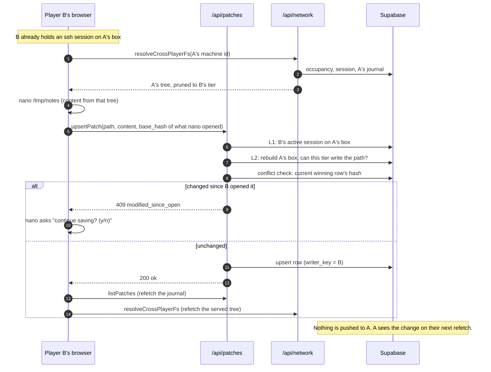

# 9. Identity, persistence, the patch journal, and client–server sync

This chapter explains who a player is, what is saved where, how every change to any machine is
stored as a shared journal, how the browser signs every request, and how it keeps its view in sync
with the server. Read it before touching `src/core/patches/`, `src/core/signedRequest/`,
`src/core/identity/`, `src/adapters/`, or the sync code in `src/ui/state.ts`.

## The shape in one paragraph

A player **is** an Ed25519 keypair generated in the browser. There are no accounts, no passwords and
no Supabase Auth. Every request to the server is a JSON envelope signed with that key, and the server
uses only the verified public key as the caller's identity. **Everything that changes in the world is
a row in one table, `patches`**: one whole-file version per (machine, path, writer). A machine's
current state is its generated base tree with all its rows replayed in server-timestamp order. The
browser never talks to the database: it calls three Vercel functions, keeps the current machine's
journal in memory, and re-pulls it after every write. Nothing is ever pushed from the server.

## What is stored where

| Where                                               | What                                                                                                 | Lifetime                              |
| --------------------------------------------------- | ---------------------------------------------------------------------------------------------------- | ------------------------------------- |
| Browser `localStorage`                              | Identity keypair, game config, theme, connected ESSID, LAN lease cache (chapter 4 has the key table) | Until `new-game` or cleared site data |
| Browser memory (Solid signals)                      | The active machine's journal, served trees, session stack, cwd, scrollback, history                  | Until reload                          |
| Supabase `patches`                                  | Every file change to every machine, by every writer                                                  | Permanent                             |
| Supabase `sessions`                                 | Every session (hop) row; active while `ended_at` is null                                             | Permanent (ended rows stay)           |
| Supabase `home_network_occupants`                   | Who is connected to which WiFi network                                                               | Until `nmcli disconnect`              |
| Supabase `network_lan_leases`, `network_public_ips` | Permanent LAN addresses per (network, player); a public IP per network                               | Permanent, never released             |

**There is no IndexedDB and no offline write queue.** A write that fails is lost and the command
reports an error. The one IndexedDB mention in the code (`src/ui/seed.ts`) is a stale comment.

The browser never opens a database connection. `@supabase/supabase-js` is imported only by `api/`
(and by the wire-check scripts in `scripts/`), always with the service-role key. All tables have row-level security enabled with **no policies**, so the
anonymous key can do nothing (chapter 10).

## Identity

- **Keypair.** `generateIdentity()` in `core/identity/identity.ts` uses `@noble/ed25519` (with
  `@noble/hashes` for SHA-512) to make a random secret key and its public key, stored as 64-character
  lowercase hex in `localStorage` under `jshack.identity`. The private key sits in plain
  `localStorage` by design: it is a game token, not a real credential.
- **Loading is strict.** Anything malformed makes `loadIdentity` return `null`, and a **new identity is
  silently generated**. That means a new player with a new world.
- **The workstation id** is `<machineName>-` plus the first 8 hex characters of
  `sha256('ed25519:' + publicKeyHex)`. The server recognises "your own box" by matching that suffix
  against the verified key. The `ed25519:` prefix is load-bearing: gateways and other machines use
  different prefixes so they can never match.

## Signed requests

`signRequest(identity, action, fields)` in `core/signedRequest/sign.ts`:

```text
payload   = JSON.stringify({ ...fields, action, nonce: <32 random hex chars>, ts: Date.now() })
signature = Ed25519.sign(privateKey, UTF-8 bytes of payload)
body      = { payload: <that exact string>, publicKey: <64 hex>, signature: <128 hex> }
```

`action`, `nonce` and `ts` are spread last so a caller cannot override them. The server verifies the
**exact bytes** it received and parses only afterwards, so there is no canonicalization to get wrong.

`verifySignedRequest(body, schema, {nonceStore})` in `core/signedRequest/verify.ts` checks, cheapest
first:

| Step | Check                                                                                                | Failure (HTTP)            |
| ---- | ---------------------------------------------------------------------------------------------------- | ------------------------- |
| 1    | Envelope shape (strict; `payload` 1–8,192 characters; hex formats)                                   | `envelope_invalid` (400)  |
| 2    | Ed25519 signature over the payload bytes                                                             | `signature_invalid` (401) |
| 3    | `JSON.parse(payload)`                                                                                | `payload_malformed` (400) |
| 4    | Base payload schema, then the action's own zod schema                                                | `payload_invalid` (400)   |
| 5    | The absolute difference between the server clock and `ts` is at most 120,000 ms, in either direction | `timestamp_skew` (401)    |
| 6    | Nonce store: has this nonce been seen?                                                               | `replay` (401)            |

On success it returns the verified `publicKey` and the parsed payload. **Handlers must use that
`publicKey` as the identity.** Every write schema also refuses client-supplied identity fields
(`player_key`, `writer_key`, …) outright.

Two consequences to know:

- **Replay protection is the 120-second window only.** Every endpoint wires a no-op nonce store, by
  the owner's decision (a real store was built and reverted as not worth it before launch; the
  re-add design is in the conventions doc §9). Within the window, the same envelope can be resent.
- **A client clock more than two minutes off breaks every request** with `timestamp_skew`. The
  player sees generic network errors; there is no clock hint.

## The patch journal

### The row

| Column                     | Meaning                                                                                                                    |
| -------------------------- | -------------------------------------------------------------------------------------------------------------------------- |
| `machine_id`               | Which machine (primary key, part 1).                                                                                       |
| `path`                     | Absolute in-game path (part 2).                                                                                            |
| `writer_key`               | Who wrote it (part 3): the verified public key, or a stable network key (`ap:<essid>`) for system logs on ownerless boxes. |
| `content`                  | Whole-file content. `NULL` on a file row is a **tombstone** (deletion).                                                    |
| `owner`                    | In-game file owner shown by `ls -l` (not the player).                                                                      |
| `permissions`              | `{read, write, execute}` tier lists, or null.                                                                              |
| `node_type`                | `'file'` or `'directory'`.                                                                                                 |
| `is_new`                   | Used only by the edit-conflict check for tombstones.                                                                       |
| `created_at`, `updated_at` | `updated_at` is re-stamped by a database trigger on every update. **It is the replay order.**                              |

The primary key `(machine_id, path, writer_key)` means **one row per file per writer**. Several
writers' versions of a file coexist; a writer's repeated writes overwrite their own row. There is no
"operation" column; `node_type`, `content` and `permissions` imply it (chapter 7 has the fold rules).

### The effective filesystem

```text
rows    = every patches row for machine M
ordered = orderPatchesForReplay(rows)   // server updated_at ascending, then writer_key
tree    = applyPatches(base, ordered)   // left fold; last write per path wins
```

- **The server's clock decides order.** A client cannot reorder history to win a path.
- **Deletes are always tombstones.** `removePatch` deletes the caller's own rows at and under the
  path, then writes a `content: null` row. A plain delete would let an older row from another writer
  resurrect the file on replay. Bricking a machine is just a tombstone on a `/boot` file.
- **Your own box has no server-side permission checks.** The L1 and L2 gates are bypassed for your own
  workstation; permission checks there happen only in the client's filesystem view.

### Writing to someone else's machine

`handleUpsertPatch` in `core/patches/upsertPatch.ts`, in order:

1. Verify the signed request.
2. **L1** (`authorizeMachineAccess`): your own workstation passes; otherwise you need an active
   session row on that machine, or it is `403 no_session`.
3. **L2** (`enforceRemoteWriteL2`): rebuild the target's base tree (access-point gateway, LAN machine,
   deep gateway, or another player's workstation from their occupancy row), replay its journal, and
   ask the shared permission walker whether your session's tier may write the path. Unresolvable →
   `403 permission_denied` (fail closed).
4. **Edit-conflict check**: if the request carries a `base_hash` (see below), the current
   winning row's content hash must match it, or the answer is `409 modified_since_open`. This runs
   after the permission gates so an unauthorized caller learns nothing about edit activity.
5. Upsert the row with `writer_key` = your verified key.



_A remote write is authorized twice (session, then tier), conflict-checked, then reconciled by
pulling, never by pushing._

### Which writes check for conflicts

Writers that rebuild a whole file from what they read send a `base_hash`: the `nano` save, the `>>`
append, `chmod` on a file, and a script's `fs.appendFile`. Blind writers (`>`, `touch`, `apt`,
pidfiles) do not, so `>` keeps meaning "truncate". `rm` has no conflict check either. The check is not atomic with the upsert,
so two saves from the same base within one request's time can both pass.

## Keeping the browser in sync

- **File writes are pessimistic.** The UI changes only after the server says `ok`. Then
  `wrapWithRefetch` (in `ui/state.ts`) awaits a journal refetch, then a served-tree refresh for
  another player's box, then broadcasts a hint to other tabs. Because commands run one at a time, the
  next command sees the new tree.
- **Session push and pop are optimistic.** The stack changes locally first; the server row is created
  or ended fire-and-forget. Sessions on **other** machines were already created by their own awaited
  login call.
- **Traces are fire-and-forget and best-effort** (chapter 8).
- **Every read is a pull.** There is no Supabase Realtime and no push channel, by decision: the legacy
  app leaked other players' changes through broadcasts, there is no database identity for row-level
  policies to key on, and it would be the first direct browser-to-database channel. Staleness is
  accepted. If it ever needs fixing, fix it with a pull (refetch before reading a log).
- **A late answer for a machine you have left is dropped.** `refetchPatches` and `refreshServedRoot`
  both check that the active machine has not changed while they were in flight; otherwise `nano`
  could save a foreign tree over a real file.

### Three kinds of tree

| Machine                                                   | How the browser gets its tree                                                          |
| --------------------------------------------------------- | -------------------------------------------------------------------------------------- |
| Your own workstation                                      | Regenerate locally from your key and config, then replay your journal (`listPatches`). |
| A generated machine (LAN machine, gateway, deep box)      | Regenerate locally from the ESSID, then replay that machine's journal.                 |
| Another player's workstation, or the access-point gateway | Ask the server (`resolveCrossPlayerFs`), which rebuilds it and prunes it to your tier. |

The server prunes by tier: the owner gets everything, a session holder gets what their tier may read,
and anyone else gets only what the network could observe (pidfiles, the boot id, firewall and SNMP
config, the web root, the package manifest).

### Tabs

After a successful write to your own machine, the writing tab refetches and then posts
`{type: 'patches-changed', machineId}` on the `jshack-sync` `BroadcastChannel`. Receiving tabs refetch
only if the id is their own workstation. A write on a remote machine is never heard by other tabs.

### Reloading

On a normal boot: identity and config come from `localStorage`; the WiFi association is restored
without a server call if both the ESSID and a lease are cached; the own journal is fetched; and
`rehydrateSessions` lists your open server sessions, keeps `ssh`, `su` and `exploit` rows as hops, and
ends every other open row as `abandoned`. The boot screen independently fetches your own journal to
check your box still boots.

## Rules you must not break

1. **Identity is the verified key, never a claim.** Stamp `writer_key`, `player_key` and `owner_key`
   from `verified.publicKey`; refuse them in payloads.
2. **Sign and verify the literal bytes.**
3. **Replay order comes from the server clock.** Sort in core with `orderPatchesForReplay`, not only
   in SQL.
4. **Deletes are tombstones.**
5. **System logs on an owned box go under the owner's key**; on an ownerless box they should go under
   the network's key (`ap:<essid>`). Some trace writers still use the caller's key there; see
   [known issues](./13-known-issues.md).
6. **Remote writes are confirmed by the server, then pulled.** Never apply them optimistically.
7. **Fail closed when the target cannot be resolved; reserve 500 for real lookup errors**, so an
   outage never looks like a denial.
8. **A whole-file write to a path others can write must be composed against the machine**
   (`env.fs.reload()`), not the client's copy. A failed read must keep the old tree, never treat it as
   empty.
9. **The wire is the threat surface.** Prune what a caller may not see before the response leaves the
   server.

## How to…

### Add a signed API call

1. **Core handler** in `src/core/<area>/<action>.ts`: a zod schema
   `z.looseObject({action: z.literal('<action>'), ...})` that refuses identity fields; call
   `verifySignedRequest` and map failures with `STATUS_BY_VERIFY_REASON`; authorize with the shared
   gates; take every database access as an injected function returning `{data, error}`; return
   `{status, body}`.
2. **Route it** in the matching `api/*.ts` before the fallthrough (chapter 10). Do not add a new file
   in `api/`.
3. **Client adapter** in `src/adapters/<area>Api.ts`: post through `signRequest`, catch throws into a
   typed failure, validate the response with zod, map statuses explicitly. Keep "we could not ask"
   (`network_error`) distinct from an answer about the target.
4. **Wire it into `ui/state.ts`** (degrading safely before `startGame`) and expose a `CommandEnv` seam
   (chapter 4). If it changes the journal of the machine being viewed, refetch and broadcast.
5. **Check the size**: the whole payload must fit 8,192 characters of JSON. Escaping inflates it:
   newlines and tabs take two characters, and other control characters take six (`\u00XX`).
6. **Test** the handler with fakes, the adapter with an injected `fetchImpl`, and add a wire-check
   (chapter 11).

### Add a new kind of patch

1. Decide the `applyPatches` rule and write its test in `filesystem/applyPatches.test.ts`.
2. Extend `upsertPatchSchema` and `PatchRow`; if it needs a column, write a migration and update
   every `select(...)` that maps rows to patches in `api/*.ts`.
3. Add the method to `PatchApi` in `core/commands/types.ts`, implement it in
   `adapters/patchApi.ts`, and **route it through `wrapWithRefetch`** in `ui/state.ts`. Missing that
   step means the write persists but nothing on screen or in other tabs hears about it.
4. Fix `mockPatchApi` in `src/test/factories/commandEnv.ts` and the other hand-written `PatchApi`
   literals in tests.
5. Check the readers: the read filter, the tree codec, the permission walker, and `canBoot` if it can
   touch `/boot`.
6. Extend a wire-check such as `testUpsertPatch.ts` or `testSharedJournal.ts`.

### Persist a new client setting

See chapter 4. Anything another player could observe, or that must be authoritative, does not belong
in `localStorage`; it needs a signed endpoint.

## Pitfalls

- **A transient failure can blank your own edits from view.** `refetchPatches` treats a failed fetch
  as an empty journal, so the view falls back to the base tree until the next successful refetch.
- **`patchClientDeps.machineId` follows the active session**, not your own box. Names like
  `fetchOwnPatches` are historical.
- **Stale views are normal.** Other players' writes and all server-written traces appear only after a
  refetch. "The log is empty" is the most common false alarm in manual testing; check the database
  row first.
- **The 8,192-character payload cap** stops large files being saved or carried home; server-appended
  logs have no cap and can outgrow what a client can re-save.
- **`removePatch`'s descendant delete uses SQL `LIKE 'P/%'`**, so `_` or `%` in a path over-match
  (only the caller's own rows).
- **Any 403 from the patch API becomes `no_session` in the client**, and 400/401 become
  `network_error`; both render as generic errors.
- **Session ids are client-minted** (for example `ssh-<user>-<ms>`, `nc-<port>-<ms>`,
  `exploit-<port>-<ms>`) and are a global primary key. A collision
  is possible in principle and unhandled.

## Where it is tested

Unit tests: `signedRequest/sign.test.ts`, `verify.test.ts` (window edges, tampering, schema paths);
`identity/*.test.ts`; `patches/*.test.ts` (L1, L2, conflict check, tombstones, ordering, traces);
`filesystem/applyPatches.test.ts`; adapter tests with an injected `fetchImpl` that verify the real
signed envelope; `ui/state.test.ts` for boot, rehydration and late-answer drops. Wire-checks:
`testUpsertPatch.ts`, `testSharedJournal.ts`, `testModifiedSinceOpen.ts`, `testCrossPlayerWrite.ts`,
`testCrossPlayerRead.ts`, `verifyPatchesRls.ts`, `testRebootEvicts.ts`.

## Deeper reading

- [`cross-player-architecture.md`](../cross-player-architecture.md): the as-built cross-player
  system. Several sections (§2, §4, §5, §6, §8 and the key-files table) still describe the dropped
  registry (`findRegistryByMachineId`, `RegistryMachine`) and an owner-keyed router; the code now keys the gateway by ESSID and resolves occupants from
  `home_network_occupants`. See [known issues](./13-known-issues.md).
